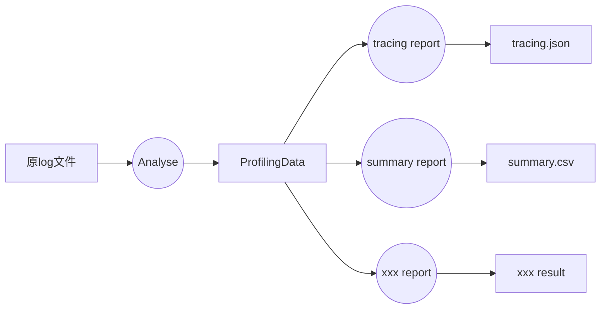

# 开发者文档

## 整体流程

ada-pa接受一个GE profiling的log输出文件，并将其解析为一系列的分析报告文件，包含tracing、summary等。整体来说，ada-pa分为两大步：



第一步的analyse将原始的log文件解析成一个中间的Python对象，基于这个易于操作的python对象，后面的各类reporter可以做对应的分析，生成所需要的分析报告。

### analyse

analyse会解析log文件，生成**一到多个**ProfilingData，analyse对接GE profiling的数据格式，对其做解析，丢弃非法数据，将解析好的数据放到ProfilingData中，ProfilingData主要包含两类内容：

* records: 所有的原始记录，原始记录的定义详见下文

* event_records：将records做加工后的event_records数据，event_record与record的区别是，event_record中包含开始与结束时间戳，而record中只有一个时间戳，另外，record会有一个et字段，表达本record表达开始还是结束

举例说明，原始的log文件中，通过如下方式描述一个事件：

```textile
10000 122080 [GatherV2] [ConstPrepare] Start
50000 122080 [GatherV2] [ConstPrepare] End
```

每一列的含义分别为：时间戳、线程id(tid)、node_name，event，et(Start或者End)

上述log文件会被解析为两个record，每个record的结构为：

```python
class Record:
    def __init__(self):
        self.node_name: str = None
        self.event: str = None
        self.et: str = None
        self.tid: int = None
        self.timestamp: int = None
        self.iteration: str = None
        self.device: str = DEV_HOST_CPU
```

例如上述两条record公共描述了一个event，这个event从时间戳10000开始，运行至50000结束，经历了40000ns

上述两条对应的record，便可以表达成一个event_record，event_record中不再有et和timestamp，而是将其替换为start和end，因此event_record的结构为：

```python
class EventRecord(Record):
    def __init__(self):
        self.node_name: str = None
        self.event: str = None
        self.tid: int = None
        self.iteration: str = None
        self.device: str = DEV_HOST_CPU()
        self.start: int = None
        self.end: int = None
```

大部分reporter只需要看event就足够了，在analyser中完成这一步解析可以大大简化reporter的解析难度。

### report

reporter解析接受一组ProfilingData(后面简称pds)，将其解析，并输出想要的内容。因为pds会被传入多个reporter使用，为了防止互相影响，所以reporter不可以修改传入的pds。

每个reporter都是一个类，这个类的构造函数接受pds，并提供一个report函数。

```python
class Reporter:
    def __init__(self, pds: [ProfilingData]):
        # 一般来说，构造函数中，reporter需要将pds保存下来，其他流程按需进行
        pass

    def report(self, path):
        """report函数，将解析好的数据生成文件，写到path路径下，
        入参path是个目录名/前缀，reporter需要自己生成前缀后面的个性化名字，最终的目录+文件名形式为：
        目录名/前缀_<result-type>_<index>.<ext>
        文件名的格式
        """
        pass
```

## TODO

* op_statistic性能较差，主要是在confirm_all_events_node_name中较慢，需要优化
* analyzer当前不支持同一线程中，time range交叉的异常场景检测（所谓交叉，是指对于两个事件A和B，有A-start > B-start && A-end < B-end）
* 同一种事件发生嵌套时，在生成summary时，会把嵌套的内层和外层全部统计在内，而这么做有可能是不准的，详见[事件嵌套的时间统计问题]("事件嵌套的时间统计问题")
* 算子内带atomic场景，atomic的tiling会被提现到上层tiling中，上层算子的kernellaunch会包含两次子KernelLaunch，其中第一次为atomic，第二次为本算子的KernelLaunch，当前会把这两次KernelLaunch都统计为上层算子的KernelLaunch中

## 已知问题详述

### 事件嵌套的时间统计问题

在出现如下的事件时：

```textile
|------Transdata Tiling-----------|
|--None Tiling--|--Atomic Tiling--|
```

其对应的场景为，Transdata为多task算子，在子图视角，认为进入了Transdata节点的tiling，在node视角，需要分两次下发不同的task，对两个task需要分别作tiling，分别是Transdata分身的tiling和额外需要下发的atomic算子的tiling。

例如下面的tiling中，None tiling（也就是transdata自己的tiling）耗时10u，atomic tiling耗时10u，外层tiling总耗时20u。那么在计算tiling的summary时，正确的结果是做了2次tiling，每次耗时10u，总耗时20u。但是当前的统计结果会变成：做了3次tiling，总耗时40u，平均每次耗时13.3u
