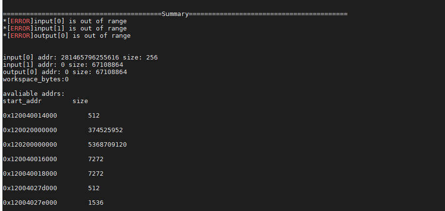
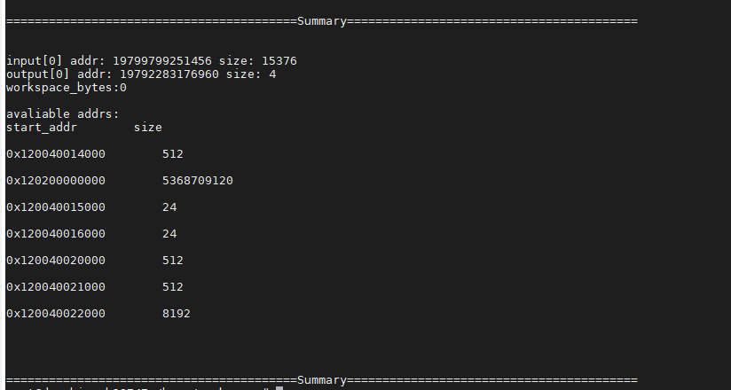

# 地址异常检测工具

算子地址异常是导致AI Core Error的常见原因。为提高系统故障维测效率，提供地址异常检测工具。

使用地址异常检测工具，可以快速获取系统异常时，系统分配的内存区间以及算子input、output所申请的地址，并进行地址比较。

## **前置条件**

获取程序运行host日志。例如：/home/user/log/host/cann。

## **使用方法**

工具使用示例：

**python3.7 addr\_checker.py -p /home/user/log/host/cann**

运行完成后，解析结果以打屏的方式显示。

若出现[图1](#fig415415271308)类似ERROR报错信息，则认为发现异常地址，请分析地址分配等操作是否合理。

**图 1**  异常地址信息  

若出现[图2](#fig270725410306)类似信息，则说明地址未出现异常，需进行进一步分析。

**图 2**  正常地址信息  

