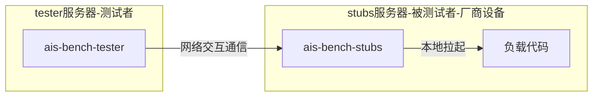
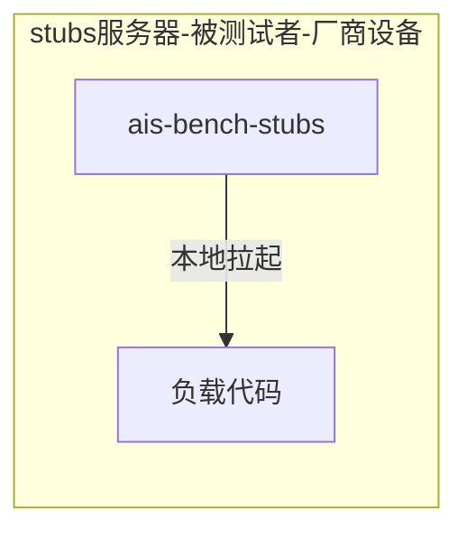
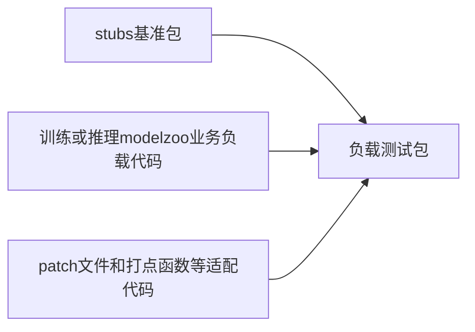

# ais-bench-workload

## 介绍  

[Tools](https://github.com/Ascend/tools.git)仓ais-bench-workload目录主要保存华为的ais-bench软件负载代码及构建代码，用于生成负载测试包对AI服务器进行性能测试。

### ais-bench软件介绍

ais-bench标准化性能测试软件，又称AI Server Benchmark软件，是根据AI标准（IEEE 2937及 T/CESA 1169-2021）对AI服务器进行性能测试的工具软件。

ais-bench软件包括如下2个测试模式：

- 网络测试场景 - 适用于正式测试场景

- 本地离线测试场景 - 适用于本地裸机测试场景，不需要联网

### 构建流程介绍

**构建流程介绍**

负载程序包需要整合ais-bench工具和负载代码，生成包含ais-bench-stubs基准程序包和负载代码的测试包。运行在厂商设备上，进行性能测试。如下图所示：

## 构建教程
请参考doc/ais-bench_workload构建教程.md

## 执行
### 解压测试包
tar -xzvf XXX.tar.gz  
说明： XXX.tar.gz是构建教程步骤4构建的测试包  

### 执行配置
训练和推理执行之前，请根据相应的指导文档"code/README.md"进行相关配置。  
对于训练，还有"code/doc"目录的指导文档可以参考。
#### 设置日志级别
日志级别说明：  
+ GLOG日志级别 INFO、 WARNING、 ERROR、FATAL对应的值分别为0、1、2、3.

设置指令： export GLOG_v=3
#####  训练日志
+ 对于modelarts训练，在code/code/ma-pre-start.sh中设置
+ 对于非modelarts训练，在code/common/mindspore_env.sh中设置

##### 推理日志
+ 在code/config/config.sh中设置

### 执行推理或训练
请参照测试包中code/README.md介绍的推理或训练执行方法进行推理训练。
## 贡献

欢迎参与贡献。更多详情，请参阅我们的[贡献者Wiki](../CONTRIBUTING.md)。

## 许可证
[Apache License 2.0](LICENSE)

