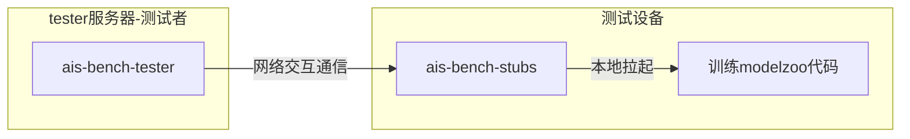
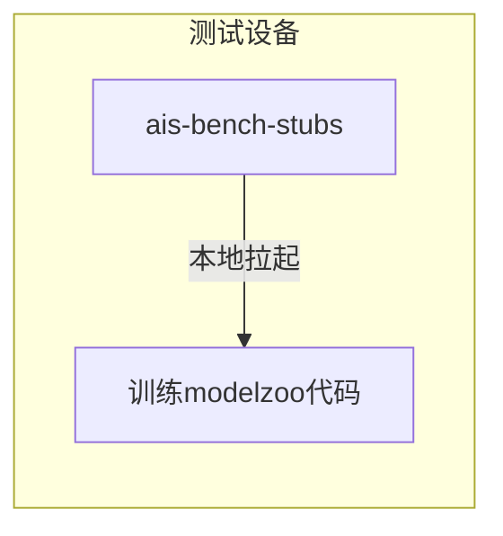

# ais-bench_workload_inference推理负载说明文档


## 简介

ais-bench标准化性能测试软件,又称AI Server Benchmark软件，是根据AI标准（IEEE 2937及 T/CESA 1169-2021）对AI服务器进行性能测试的工具软件。

本文主要介绍基于ais-bench软件，适配华为模型负载，实现推理业务性能测试的方法。包含程序包构建、配置、运行等流程。

### 流程介绍

网络测试模式流程如下。



离线测试模式流程如下。



## 构建

请参考 《ais-bench_workload负载程序包构建教程》

## 测试

注意本测试以离线测试为准。不连接Tester服务器。

### 环境准备

1. Atals推理设备。如果在容器中运行，请查看附录
2. 安装好CANN软件包。
3. 数据集准备

​		举例resnet模型需要imagenet数据集，bert模型需要wiki数据集，该数据集需要提前下载到运行设备中。

4. 负载测试包准备：

​	在《构建》章节中会生成对应的负载测试包。

5. 对于昇腾推理设备，需要设置对应的环境编译，以便可以执行推理操作。对于不同的设备，请设置对应的路径的set_env.sh，如下为样例命令，假设安装的cann包路径为/usr/local/Ascend/ascend-toolkit中。

   ```
   source /usr/local/Ascend/ascend-toolkit/set_env.sh
   ```

   注意，Atlas 500环境请执行source /opt/ascend/nnrt/set_env.sh 

### 软件依赖

1. loadgen模块

   负载生成器LoadGenerator模块是AIS-Bench推理任务的必备的控制套件，负责负载生成、控制、统计等功能。会根据不同的设置与参数，对负载执行不同的分发策略，以满足不同场景下的测试要求。

   请获取loadgen程序包，进行安装。该部分以whl包方式提供，需要通过如下命令安装，要注意python版本与包的对应关系

   ```
   pip3 install loadgen-0.0.1-cp37-cp37m-linux_aarch64.whl
   ```

2. aclruntime模块

   [aclruntime模块](https://github.com/Ascend/tools/tree/master/ais-bench_workload/tool/ais_infer)是基于华为cann软件栈开发的推理程序包。在官网地址可以直接编译出python程序包。

   执行如下命令，进行安装。

   ```
   pip3 install aclruntime-0.0.1-cp37-cp37m-linux_aarch64.whl
   ```

3. 其他软件依赖

   请查看 基准路径/code/requirements.txt，查看负载程序要求的依赖，执行如下命令进行安装

   ```
   pip3 install -r requirements.txt
   ```

### 配置

配置信息是比较重要的，需要用户仔细审视。

#### config.json  ais-bench工具配置文件 

位于基准目录/code/config.json 主要填写ais-bench测试的具体参数与tester服务器具体信息，**本地测试模式下不需要填写，只要网络测试模式下才需要填写。**

如果需要网络测试，请修改配置文件内容。

#### config.sh 通用负载配置文件

位于 基准路径/code/config/config.sh 主要包括基准配置信息。请打开配置文件，仔细填写。

**注意**

1. 请注意填写PROFILE场景字段，该字段指定了推理运行的前后处理过程，请查看支持文档填写（code/README.md）。

2. 动态分档设置如下

   - 动态batch

     增加 export DYM_BATCH=1 设置指定的batchsize

   - 动态宽高

     增加 export DYM_HW="224,224" 设置指定的宽高

   -  动态Dims

     增加 export DYM_DIMS="actual_input_1:1,3,224,224" 设置指定的dims 该设置格式跟atc命令转换一致

### 启动运行

配置好指定配置文件后，执行`./ais-bench-stubs test`，即可启动本地运行模式，执行性能测试。

整个训练过程，需要保持网络通畅。

## 附录

### **日志级别设置：**

如果需要设置日志级别，请在 基准目录/common/config.sh中设置相关变量。

```
export GLOG_v=3
```

备注：

+ GLOG日志级别 INFO、 WARNING、 ERROR、FATAL对应的值分别为0、1、2、3

### 推理容器制作与使用

请参考[推理执行容器环境搭建指导](https://github.com/Ascend/tools/tree/master/ais-bench_workload/doc/ais-bench_workload推理执行容器环境搭建指导.md)