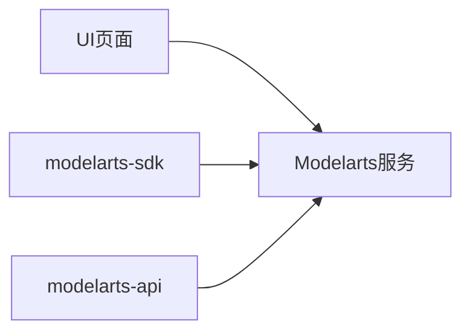
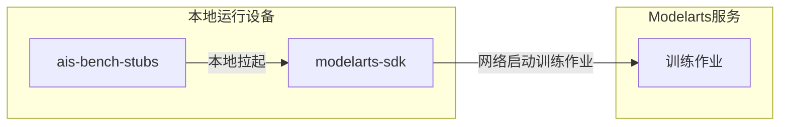
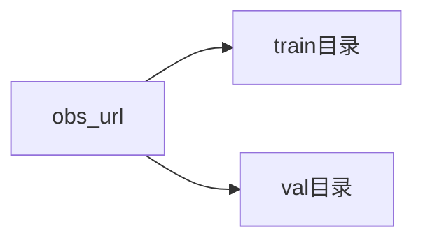
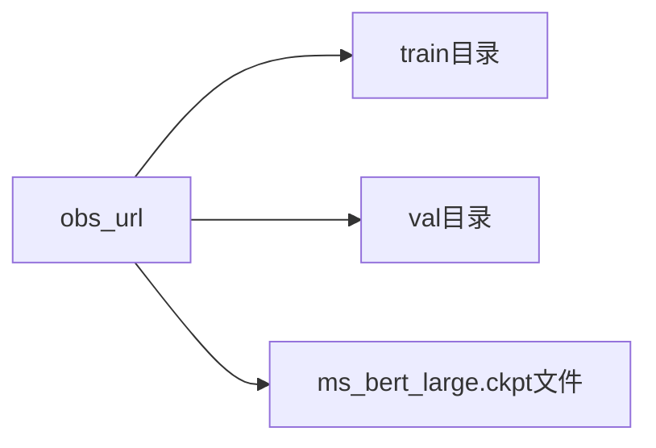

# ais-bench_workload_train_modelarts训练说明文档


[TOC]

## 简介
ais-bench标准化性能测试软件，又称AI Server Benchmark软件，是根据AI标准（IEEE 2937及 T/CESA 1169-2021）对AI服务器进行性能测试的工具软件。

[Modelarts](https://support.huaweicloud.com/productdesc-modelarts/modelarts_01_0001.html)是面向AI开发者的一站式开发平台，提供海量数据预处理及半自动化标注、大规模分布式训练、自动化模型生成及端-边-云模型按需部署能力，帮助用户快速创建和部署模型，管理全周期AI工作流。

本文主要介绍基于ais-bench软件，适配ModelArts平台，实现集群训练业务性能测试的方法。包含程序包构建、配置、运行等流程。

### 流程介绍

modelarts业务启动有如下三种方式运行。

为了适配ais-bench软件测试流程，需要ais-bench-stubs程序拉起运行，并做控制与处理，所以选择modelarts-sdk作为启动方式。





如下测试流程，本测试需要一台本地运行设备，用于给modelarts服务下发训练作业。





```sequence
本地运行设备->>OBS存储: 上传运行代码
本地运行设备->>ModelArts侧: 传递训练参数，拉起训练
ModelArts侧->>OBS存储: 请求下载训练代码
OBS存储->>ModelArts侧: 下载代码
ModelArts侧->>OBS存储: 请求下载数据集
OBS存储->>ModelArts侧: 下载数据集
ModelArts侧->>ModelArts侧: 执行训练
ModelArts侧->>OBS存储: 上传throughput/accuracy数据
ModelArts侧->>本地运行设备: 训练完成
本地运行设备->>OBS存储: 请求下载throughput/accuracy数据
OBS存储->>本地运行设备: 下载数据
```

整体流程如上图所示，大致可分为3个步骤：

1. 用户需准备本地运行设备。
2. 填写配置信息。
3. 用户在本地运行设备中启动ais-bench-stubs程序，执行完成后获取性能数据结果。

## 构建

请参考doc/ais-bench_workload构建教程.md。

## 测试

### 环境准备

#### 本地运行设备

本地运行设备是需要运行ais-bench软件的stubs程序。该设备要求如下

1. 运行为linux系统，linux虚拟机也可以。
2. 能够连接网络。

本文建议可通过以下三种方式

1. ECS云主机，可以咨询计算中心运维同事搭建启动ECS云主机。
2. Modelarts的notebook开发环境。 请参考附录”Notebook进行modelarts训练配置”小节。
3. 在windows上开启WSL linux子系统。按照说明强参考[官方链接。](https://docs.microsoft.com/zh-cn/windows/wsl/install)

#### Modelarts版本依赖

本程序当前在modelarts版本 >= 21.9.0 验证过，低于该版本未做验证。

#### 软件依赖

1. python3命令。

2. easydict python程序包。请使用如下命令进行安装。当前以pip3为例，请选择您对应要使用的python版本的pip命令。

   ```本
   pip3 install easydict
   ```

3. modelarts-sdk程序包。请根据[官网教程](https://support.huaweicloud.com/sdkreference-modelarts/modelarts_04_0004.html)执行安装。


#### 数据集准备

举例resnet模型需要imagenet数据集，bert模型需要wiki数据集，该数据集需要提前上传到OBS存储中。所以用户必须提前上传到指定的路径中。

注意imagenet数据集图片非常多，上传数据很慢，需要提前进行下载数据集和上传OBS存储。

训练作业的数据输入当前限定为一个，所以train和eval的数据集以及其它必要文件都要保存一个obs目录。

resnet模型数据集imagenet。obs存储上约定的文件夹格式如下。train目录存放训练数据集，val存放eval数据集。

如下图，数据输出传递的路径为 obs_url



bert模型数据集imagenet。obs存储上约定的文件夹格式如下。train目录存放训练数据集，val存放eval数据集，ms_bert_large.ckpt是预训练ckpt文件。

如下图，数据输出传递的路径为 obs_url




### 负载测试包准备：

在《构建》章节中会生成对应的负载测试包。

#### 负载包选择

注意负载程序包会包含不同架构的测试包，请根据本地运行设备的架构进行选择。

- 本地运行环境是x86_64架构，请选择xxxx_x86_64_xxx_modelarts.tar.gz程序包。
- 本地运行环境是aarch64架构，请选择xxxx_aarch64_xxx_modelarts.tar.gz程序包。

比如，aarch64环境运行mindspore框架r1.3版本的resnet模型训练包，应选择train_huawei_train_mindspore_resnet-Ais-Benchmark-Stubs-aarch64-1.0-r1.3_modelarts.tar.gz。

拷贝解压

登录本地运行设备，将负载测试包拷贝到指定的文件夹。

登录本地运行设备控制台，找到对应测试包。执行解压操作。

```
tar xvf train_huawei_train_mindspore_resnet-Ais-Benchmark-Stubs-aarch64-1.0-r1.3_modelarts.tar.gz
```

执行如下命令，会看到解压后包含如下内容

```
root# ls
ais-bench-stubs  code  log  result  tmp
```

### 配置

配置信息是比较重要的，需要用户仔细审视。

#### config.json  ais-bench工具配置文件

位于基准目录/code/config.json 主要填写ais-bench测试的具体参数与tester服务器具体信息，**本地测试模式下不需要填写，只要网络测试模式下才需要填写。**

#### config.sh 通用负载配置文件

位于 基准路径/code/config/config.sh 主要包括基准配置信息。

与当前modelarts集群左右相关的如下参数，其他不需要关心

**PYTHON_COMMAND**

```
export PYTHON_COMMAND=python3.7
```

**必须要设置为跟当前运行环境匹配的python版本。同时该版本也必须安装对应的python软件依赖。**

**SINGLESERVER_MODE**

**单服务器模式指运行n个设备。但是运行是各自设备进行单设备8卡进行业务训练，默认不开启。**

**如果需要打开该模式 请增加如下命令 export SINGLESERVER_MODE=True**


#### modelarts_config.py   modelarts配置文件

位于基准路径/code/config/modelarts_config.py ， 主要包括modelarts的鉴权和训练参数信息，是主要的配置文件。

比较重要和必须要设置的参数如下：

**access_config配置：必须填写，包含modelarts认证信息，请通过计算中心或者云服务的运维同事获取并确定。**

**session_config配置：必须填写，包含训练作业参数信息。**


注意：

1. 如果access_config.iam_endpoint access_config.obs_endpoint access_config.modelarts_endpoint三个参数需要填写，必须要设置对应的域名解析地址，该地址请咨询运维同事获取。

   如果本地运行设备是在ECS和Notebook中，且与modelarts服务同一网络，那么可以保证连通性，不需要设置。

   华为云服务不需要设置。只有计算中心才需要设置。

2. 当前选择的容器镜像版本是默认modelarts自带的，如果需要更新为指定的mindspore和cann版本。请参考 附录-cann包和mindspore软件更新章节

3. session_config.hyperparameters 请参考对应的模型说明文档。路径位于xxxx

3. 注意节点配置不能跨资源池。要么使用某个资源池，要么使用公共节点，不能一起使用

### 启动运行

配置好指定配置文件后，执行`./ais-bench-stubs test`，即可启动本地运行模式，执行性能测试。

整个训练过程，需要保持网络通畅。

#### 训练作业日志查看：

modlearts训练作业日志可以查看 云上modelarts界面，也可以通过obs输出日志路径查看日志信息。

同时本程序提供了本地定时同步日志操作。在运行过程中，在《基准目录/log》中会定时更新训练作业的日志信息文件。如下job3be1f0e5-job-aisbench-debug-0.log和job3be1f0e5-job-aisbench-debug-1.log文件为modelarts训练作业日志。

```bash
[root@node66 ]# ls
ais-bench-stubs  code  log  result
[root@node66 ]# ls log/
benchmark.log  job3be1f0e5-job-aisbench-debug-0.log  job3be1f0e5-job-aisbench-debug-1.log  stub.log

```

### 中断和停止训练

+ 云上modelarts界面操作
  在云环境modelarts服务“训练管理”->“训练作业”界面，点击正在运行的job链接并进入。在执行job界面，点击“更多操作”按钮，激活下拉菜单，在上下文菜单中点击“停止”，即可终止运行的job。
+ 本地停止方法，如下操作即可。该操作可以停止掉配置文件中job_name指示的最新一个作业版本

```
[root@node66 ]# ls
ais-bench-stubs  code  log  result
[root@node66 code]# python3  ./code/common/train_modelarts.py  --action stop
jobname:aisbench-debug jobid:3043 preversionid:13231 jobstatus:JOBSTAT_RUNNING stop status:{'is_success': True}
```

### 结果呈现和展示

- 2个实例（train_instance_count为2）的bert r1.3 modelarts训练结果为例展示训练结果：

```bash
report >> throughput_list:[450.77798444604605, 450.38567065252664] average:450.58182754928634
report >> accuracy_list:[0.7138142585754395, 0.7139078378677368] average:0.7138610482215881
2022-07-13T13:24:43 -Ais-Bench-Stubs- INFO run_eval(modelarts_run.sh:32) - run_eval called
2022-07-13T13:24:43 -Ais-Bench-Stubs- INFO get_result(modelarts_run.sh:37) - get_result called
[2022-7-13 11:27:19][INFO]get ConfigInfo testid:20210126-ljp0IY, Mode:training, Model:resnet50_v1.5, Divsion:close, Scenario:generic, test_object_type:single, tester_server_ip:127.0.0.1, tester_server_port:9527
[2022-7-13 11:27:19][INFO]ais bench stubs begin run
[2022-7-13 11:27:19][INFO]workpath:/home/lhb/test6/train_huawei_train_mindspore_bert-Ais-Benchmark-Stubs-aarch64-1.0-r1.3_modelarts-single-0711 go testcase.
[2022-7-13 11:27:19][INFO]Benchmanager::Init() enter
[2022-7-13 11:27:19][INFO]Transmit_server start listen 0.0.0.0 : 9990
[2022-7-13 11:27:19][INFO]get ConfigInfo testid:20210126-ljp0IY, Mode:training, Model:resnet50_v1.5, Divsion:close, Scenario:generic, test_object_type:single, tester_server_ip:127.0.0.1, tester_server_port:9527
[2022-7-13 11:27:19][INFO]ais bench stubs begin run
[2022-7-13 11:27:19][INFO]workpath:/home/lhb/test6/train_huawei_train_mindspore_bert-Ais-Benchmark-Stubs-aarch64-1.0-r1.3_modelarts-single-0711 go testcase.
[2022-7-13 11:27:19][INFO]Benchmanager::Init() enter
[2022-7-13 11:27:19][INFO]Transmit_server start listen 0.0.0.0 : 9990
[2022-7-13 13:24:48][INFO]train_result_info: {
   "accuracy" : "0.7138610482215881",
   "average_power" : 0,
   "dataload_end_time" : "2020-01-30 14:16:00",
   "dataload_start_time" : "2020-01-30 14:16:00",
   "efficientcy" : 0,
   "energy_consumption" : 0,
   "max_power" : 0,
   "prepare_end_time" : "2020-01-30 14:16:00",
   "prepare_start_time" : "2020-01-30 14:16:00",
   "proc_end_time" : "2020-01-30 14:16:00",
   "proc_start_time" : "2020-01-30 14:16:00",
   "resource_util_ratio" : 0,
   "throughput_ratio" : "450.58182754928634",
   "total_end_time" : "2022-07-13 13:24:43",
   "total_start_time" : "2022-07-13 11:27:19"
}

[2022-7-13 13:24:48][INFO]Transmit_server resource is released!
[2022-7-13 13:24:51][INFO]BenchManager stop done
```

- 2个实例（train_instance_count为2）的resnet r1.3 modelarts训练结果为例展示训练结果：

report >> throughput_list:[14147.314993295107, 14155.048461692913] average:14151.181727494011
report >> accuracy_list:[0.7705078125, 0.7707316080729166] average:0.7706197102864583
2022-07-12T15:29:13 -Ais-Bench-Stubs- INFO run_eval(modelarts_run.sh:32) - run_eval called
2022-07-12T15:29:13 -Ais-Bench-Stubs- INFO get_result(modelarts_run.sh:37) - get_result called
[2022-7-12 12:19:43][INFO]get ConfigInfo testid:20210126-ljp0IY, Mode:training, Model:resnet50_v1.5, Divsion:close, Scenario:generic, test_object_type:single, tester_server_ip:127.0.0.1, tester_server_port:9527
[2022-7-12 12:19:43][INFO]ais bench stubs begin run
[2022-7-12 12:19:43][INFO]workpath:/home/lhb/test6/train_huawei_train_mindspore_resnet-Ais-Benchmark-Stubs-aarch64-1.0-r1.3_modelarts-single-0712 go testcase.
[2022-7-12 12:19:43][INFO]Benchmanager::Init() enter
2022-7-12 12:19:43][INFO]Transmit_server start listen 0.0.0.0 : 9990
2022-7-12 12:19:43][INFO]get ConfigInfo testid:20210126-ljp0IY, Mode:training, Model:resnet50_v1.5, Divsion:close, Scenario:generic, test_object_type:single, tester_server_ip:127.0.0.1, tester_server_port:9527
[2022-7-12 12:19:43][INFO]ais bench stubs begin run
[2022-7-12 12:19:43][INFO]workpath:/home/lhb/test6/train_huawei_train_mindspore_resnet-Ais-Benchmark-Stubs-aarch64-1.0-r1.3_modelarts-single-0712 go testcase.
2022-7-12 12:19:43][INFO]Benchmanager::Init() enter
[2022-7-12 12:19:43][INFO]Transmit_server start listen 0.0.0.0 : 9990
[2022-7-12 15:29:18][INFO]train_result_info: {
   "accuracy" : "0.7706197102864583",
   "average_power" : 0,
   "dataload_end_time" : "2020-01-30 14:16:00",
   "dataload_start_time" : "2020-01-30 14:16:00",
   "efficientcy" : 0,
   "energy_consumption" : 0,
   "max_power" : 0,
   "prepare_end_time" : "2020-01-30 14:16:00",
   "prepare_start_time" : "2020-01-30 14:16:00",
   "proc_end_time" : "2020-01-30 14:16:00",
   "proc_start_time" : "2020-01-30 14:16:00",
   "resource_util_ratio" : 0,
   "throughput_ratio" : "14151.181727494011",
   "total_end_time" : "2022-07-12 15:29:13",
   "total_start_time" : "2022-07-12 12:19:43"
}

[2022-7-12 15:29:18][INFO]Transmit_server resource is released!
2022-7-12 15:29:21][INFO]BenchManager stop done

## 附录

### cann包和mindspore软件更新

如果当前测试需要更新cann包，需要在训练主程序py文件同级目录（code/code）增加ma-pre-start.sh脚本，并增加对应的run包文件，同时还需要去obs桶“代码目录”的子目录run中删除冗余的文件，避免旧文件干扰新版本测试。

ma-pre-start.sh内容类似以下内容：

```BASH
 #!/bin/bash
 set -x
 echo "Start to intall the run package"
 LOCAL_DIR=$(cd "$(dirname "$0")";pwd)
 echo $LOCAL_DIR

 TRAIN_PY_PATH=$(readlink -f `find ./ -name train.py`)
 BASE_PATH=`dirname $TRAIN_PY_PATH`

 pip install $BASE_PATH/run/protobuf*.whl
 pip install $BASE_PATH/run/mindspore_ascend*.whl
 echo "replace origin mindspore packet!!! done ret:$? !!!"

 sudo chmod +x $BASE_PATH/run/*.run
 CANN_RUN_PACKET=`find $BASE_PATH/run/ -name Ascend-cann-nnae*.run`
 sudo $CANN_RUN_PACKET --upgrade
 echo "replace origin CANN_RUN_PACKET!!!: $CANN_RUN_PACKET done ret:$? !!!"

 # env set
 export GLOG_v=3
 export ASCEND_GLOBAL_LOG_LEVEL=3
 export ASCEND_GLOBAL_EVENT_ENABLE=0
 export ASCEND_SLOG_PRINT_TO_STDOUT=0

 set +x

```

run目录文件结果示例：

```bash
[root@node66 run]# tree -L 1
.
├── Ascend-cann-nnae_5.0.2.1_linux-aarch64.run
├── mindspore_ascend-1.3.0-cp37-cp37m-linux_aarch64.whl
└── protobuf-3.20.1-cp37-cp37m-linux_aarch64.whl
```

### Notebook进行modelarts训练配置

请参照《modelarts_notebook使用入门指导》进行配置

### 日志级别设置

通过修改ma-pre-start.sh文件中“GLOG_v”和“ASCEND_GLOBAL_LOG_LEVEL”的变量值，可以更新日志的级别。

+ GLOG日志级别 INFO、 WARNING、 ERROR、FATAL对应的值分别为0、1、2、3.
+ ASCEND_GLOBAL_LOG_LEVEL日志级别DEBUG、INFO、WARNING、ERROR、NULL对应的值分别为0、1、2、3、4.


### 域名解析地址增加

请咨询modelarts所在云环境的运维，获取该云相关服务（obs、modelarts、swr）域名和IP的映射关系并写入/etc/hosts,

比如武汉云相关服务obs、modelarts、swr域名映射关系如下：

```bash
58.48.42.196 obs.cn-central-221.ovaijisuan.com
58.48.42.193 modelarts.cn-central-221.ovaijisuan.com
58.48.42.198 swr.cn-central-221.ovaijisuan.com
```

注意：

- 如果在notebook中运行，不需要设置该项
- 华为云不需要


## FAQ
