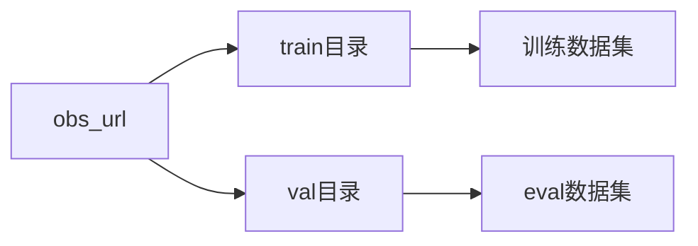
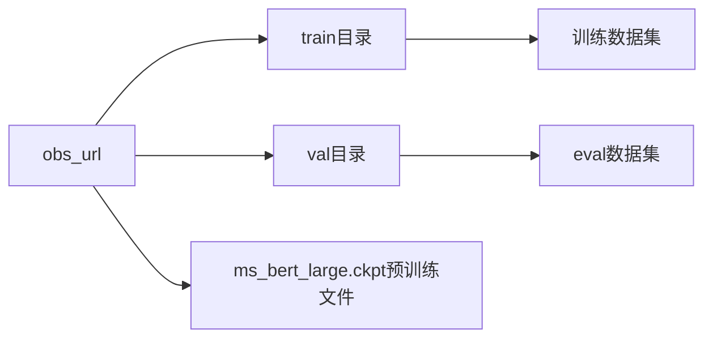

# ais-bench_workload_train_modelarts训练说明文档


[TOC]

## 简介
ais-bench标准化性能测试软件，又称AI Server Benchmark软件，是根据AI标准（IEEE 2937及 T/CESA 1169-2021）对AI服务器进行性能测试的工具软件。

本文主要介绍基于ais-bench软件，在ModelArts平台（线上环境）对模型进行训练性能测试。主要实现集群训练业务性能测试场景。

[Modelarts](https://support.huaweicloud.com/productdesc-modelarts/modelarts_01_0001.html)是面向AI开发者的一站式开发平台，提供海量数据预处理及半自动化标注、大规模分布式训练、自动化模型生成及端-边-云模型按需部署能力，帮助用户快速创建和部署模型，管理全周期AI工作流。

## 流程介绍
modelarts业务启动有如下三种方式运行:


ModelArts线上训练性能测试选择modelarts-sdk作为启动方式，通过ais-bench-stubs拉起modelarts-sdk向ModelArts平台下发训练作业指令。


测试操作总体流程：
如下测试流程，本测试需要一台本地运行设备，用于给modelarts服务下发训练作业。


测试过程数据传输原理图：

```sequence
本地运行设备->>OBS存储: 上传运行代码
本地运行设备->>ModelArts侧: 传递训练参数，拉起训练
ModelArts侧->>OBS存储: 请求下载训练代码
OBS存储->>ModelArts侧: 下载代码
ModelArts侧->>OBS存储: 请求下载数据集
OBS存储->>ModelArts侧: 下载数据集
ModelArts侧->>ModelArts侧: 执行训练
ModelArts侧->>OBS存储: 上传throughput/accuracy数据
ModelArts侧->>本地运行设备: 训练完成
本地运行设备->>OBS存储: 请求下载throughput/accuracy数据
OBS存储->>本地运行设备: 下载数据
```

测试操作总体步骤：

1. 准备本地运行设备环境。
2. 填写配置信息。
3. 本地运行设备启动ais-bench-stubs程序，执行完成后获取性能数据结果。

## 使用前准备

### 环境

#### 本地运行设备

- 安装Linux系统。
- 处于稳定的联网状态且能够与云上计算节点联网。

建议选择以下三种作为本地运行设备：

- ECS云主机，可以咨询计算中心运维同事搭建启动ECS云主机。
- Modelarts的notebook开发环境。 请参考《modelarts_notebook使用入门指导》。
- windows上开启WSL linux子系统。请参考[官方链接。](https://docs.microsoft.com/zh-cn/windows/wsl/install)

#### 软件依赖

- 安装Python3

- 安装easydict python程序包。

   请使用如下命令进行安装（当前以pip3为例，请选择与Python版本对应的的pip命令）：

   ```
   pip3 install easydict
   ```

- 安装modelarts-sdk程序包。请根据[modelarts-sdk官网教程](https://support.huaweicloud.com/sdkreference-modelarts/modelarts_04_0004.html)下载对应版本并执行安装。
- 当前适配ModelArts版本 >= 21.9.0
### 数据集

下载相关模型数据集并上传至OBS存储中。

注意：数据集的数据量较大，需要在执行测试前下载并上传至OBS，OBS上传操作请查看具体OBS操作指导。

以resnet模型的imagenet数据集，bert模型的enwiki数据集为例。具体下载方式请至相关模型官网，本文不作详述。

由于当前OBS限定训练作业的数据输入为一个目录（示例名称：obs_url），故imagenet或enwiki数据集上传至OBS存储时的目录结构如下：

imagenet



enviki




### 软件包

请参见 《ais-bench_workload构建教程》，完成需要测试的模型对应的性能测试软件包构建。

#### 选择软件包

注意性能测试软件包会包含不同系统架构，请根据运行设备的系统架构进行选择。

- 比如运行设备的系统架构为x86_64架构，那么请选择xxxx_x86_64_xxx_modelarts.tar.gz软件包。
- 比如运行设备的系统架构为aarch64架构，那么请选择xxxx_aarch64_xxx_modelarts.tar.gz软件包。

本文以mindspore框架r1.3版本的resnet模型运行设备aarch64环境进行举例，选择train_huawei_train_mindspore_resnet-Ais-Benchmark-Stubs-aarch64-1.0-r1.3_modelarts.tar.gz软件包。

#### 解压软件包

登录本地运行设备，将性能测试软件包拷贝到任意目录下，执行解压操作。

```
tar xvf train_huawei_train_mindspore_resnet-Ais-Benchmark-Stubs-aarch64-1.0-r1.3_modelarts.tar.gz
```

软件包解压后目录结构如下：

```
.
├── ais-bench-stubs  // 性能测试命令行工具，用于执行性能测试操作
├── code  // 性能测试代码包
│   ├── config  // 配置目录
│   │   ├── config.sh  // 离线训练性能测试配置文件
│   │   ├── mindspore_env.sh  // Mindspore框架模型测试时的环境变量，可根据实际需求补充环境变量
│   │   ├── modelarts_config.py  // 线上训练性能测试时配置
│   │   └── tensorflow_env.sh  // TensorFlow框架模型测试时的环境变量，可根据实际需求补充环境变量
│   ├── config.json  // tester服务器信息配置文件，配置后可自动将测试结果上报到tester服务器上。本地离线测试模式下不需要填写
│   ├── doc  // 指导文档存放目录
│   └── system.json  // 性能测试系统信息配置文件，仅当需要将测试结果上报到tester服务器时需要配置。本地离线测试模式下不需要填写
├── log  // 日志输出目录
├── README.md  // 测试指导文档
├── result  // 测试结果输出目录
└── tmp  // 数据缓存
```


## 线上训练性能测试操作

### 文件配置

#### 配置modelarts_config.py

modelarts_config.py是modelarts运行配置文件，位于性能测试软件包解压路径/code/config/modelarts_config.py，主要包括modelarts的鉴权和训练参数信息。

比较重要和必须要设置的参数如下：

**access_config配置：必须填写，包含modelarts认证信息，请通过计算中心或者云服务的运维同事获取并确定。**

**session_config配置：必须填写，包含训练作业参数信息。其中session_config是modelarts V1版本的配置，session_config_v2是modelarts V2版本的配置。**

请根据配置文件的注释来编辑配置。

注意：

1. 如果access_config.iam_endpoint access_config.obs_endpoint access_config.modelarts_endpoint三个参数需要填写，必须要设置对应的域名解析地址，该地址请咨询运维同事获取。

   如果本地运行设备是在ECS和Notebook中，且与modelarts服务同一网络，那么可以保证连通性，不需要设置。

   华为云服务不需要设置。只有计算中心才需要设置。

2. 当前选择的容器镜像版本是默认modelarts自带的，如果需要更新为指定的mindspore和cann版本。请参考“附录>CANN包和MindSpore软件更新”。

3. 训练运行参数v1版本的session_config.hyperparameters和V2版本的session_config_v2.parameters，请参考对应的模型训练启动文件的运行参数。

4. 注意节点配置不能跨资源池。要么使用专属资源池，要么使用公共资源池，不能一起使用。

5. 注意如果是多个节点，只能选择8卡设置。如果是非8卡，比如2节点1卡、2节点2卡、2节点4卡，当前modelarts不支持

6. modelarts配置项的详细配置方法，请参照配置文件中的注释说明

#### 配置config.sh

config.sh通用负载配置文件，位于性能测试软件包解压路径/code/config/config.sh，主要包括离线训练性能测试操作的基本配置信息。

编辑文件：

```
# 必选，需设置为与当前环境匹配的Python版本
export PYTHON_COMMAND=python3.7
# 单服务器模式，取值为True/False，配置后各训练节点测试结果单独反馈，关闭时测试结果为各设备汇总性能结果。可选，默认关闭。
export SINGLESERVER_MODE=True
```
**modelarts训练版本配置**
本配置文件中增加如下配置，可将当前Modelarts运行版本配置为V2:
```bash
#modelarts version default "V1", Optional value ["V1", "V2"]
export MODELARTS_VERSION=V2
```
该环境变量默认是V1版本,不设置。需要执行modelarts V2版本时请显示声明该变量为"V2"


#### 配置config.json

config.json tester服务器信息配置文件，位于性能测试软件包解压路径/code/config.json，主要填写ais-bench测试的tester服务器具体信息，用于在完成性能测试后将测试结果上报到tester服务器上。若无须上报测试结果，可不配置。

### 运行测试

完成配置文件配置后执行性能测试操作，本地离线测试模式(aisbench测试模式概念请参考[链接](https://github.com/Ascend/tools/blob/master/ais-bench_workload/README.md))命令如下：

```
./ais-bench-stubs test
```

### 中断和停止训练

+ 云环境ModleArts界面操作。
  在云环境ModleArts服务“训练管理 > 训练作业”界面，单击正在运行的job链接并进入。在执行job界面，单击“更多操作”按钮，激活下拉菜单，在上下文菜单中单击“停止”，即可终止运行的job。
  
+ 本地运行设备停止方法，操作如下：

  对于modelarts V1版本：

```bash
[root@node66 ]# ls
ais-bench-stubs  code  log  result
[root@node66 code]# python3  ./code/common/train_modelarts.py  --action stop
jobname:aisbench-debug jobid:3043 preversionid:13231 jobstatus:JOBSTAT_RUNNING stop status:{'is_success': True}
```
该操作可以停止配置文件中job_name指示的最新一个作业版本。
​   对于modelarts V2版本：

创建job成功后，本地运行设备屏幕会打印job相关信息，请搜索类似“create job sucess. job_id:c8e62b62-9529-4696-ba08-2969f4861a5d”，取"job_id:"后面部分，就是Job_id。

```bash
[root@node66 ]# python3  ./code/common/train_modelarts.py  --action stop --modelarts_version V2  --job_id e7052953-3107-47d5-a5fa-725f9eced6e3
stop jobid:e7052953-3107-47d5-a5fa-725f9eced6e3 sesion:<modelarts.session.Session object at 0xffffa1f96e10>
INFO:root:Successfully stop the job e7052953-3107-47d5-a5fa-725f9eced6e3
job stop status: Terminated
```


### 结果呈现和展示

- 以2个节点（modelarts_config.py配置文件中train_instance_count参数配置为2）的bert r1.3 modelarts训练结果为例展示训练结果：

```bash
report >> throughput_list:[450.77798444604605, 450.38567065252664] average:450.58182754928634
report >> accuracy_list:[0.7138142585754395, 0.7139078378677368] average:0.7138610482215881
2022-07-13T13:24:43 -Ais-Bench-Stubs- INFO run_eval(modelarts_run.sh:32) - run_eval called
2022-07-13T13:24:43 -Ais-Bench-Stubs- INFO get_result(modelarts_run.sh:37) - get_result called
[2022-7-13 11:27:19][INFO]get ConfigInfo testid:20210126-ljp0IY, Mode:training, Model:resnet50_v1.5, Divsion:close, Scenario:generic, test_object_type:single, tester_server_ip:127.0.0.1, tester_server_port:9527
[2022-7-13 11:27:19][INFO]ais bench stubs begin run
[2022-7-13 11:27:19][INFO]workpath:/home/lhb/test6/train_huawei_train_mindspore_bert-Ais-Benchmark-Stubs-aarch64-1.0-r1.3_modelarts-single-0711 go testcase.
[2022-7-13 11:27:19][INFO]Benchmanager::Init() enter
[2022-7-13 11:27:19][INFO]Transmit_server start listen 0.0.0.0 : 9990
[2022-7-13 11:27:19][INFO]get ConfigInfo testid:20210126-ljp0IY, Mode:training, Model:resnet50_v1.5, Divsion:close, Scenario:generic, test_object_type:single, tester_server_ip:127.0.0.1, tester_server_port:9527
[2022-7-13 11:27:19][INFO]ais bench stubs begin run
[2022-7-13 11:27:19][INFO]workpath:/home/lhb/test6/train_huawei_train_mindspore_bert-Ais-Benchmark-Stubs-aarch64-1.0-r1.3_modelarts-single-0711 go testcase.
[2022-7-13 11:27:19][INFO]Benchmanager::Init() enter
[2022-7-13 11:27:19][INFO]Transmit_server start listen 0.0.0.0 : 9990
[2022-7-13 13:24:48][INFO]train_result_info: {
   "accuracy" : "0.7138610482215881",
   "average_power" : 0,
   "dataload_end_time" : "2020-01-30 14:16:00",
   "dataload_start_time" : "2020-01-30 14:16:00",
   "efficientcy" : 0,
   "energy_consumption" : 0,
   "max_power" : 0,
   "prepare_end_time" : "2020-01-30 14:16:00",
   "prepare_start_time" : "2020-01-30 14:16:00",
   "proc_end_time" : "2020-01-30 14:16:00",
   "proc_start_time" : "2020-01-30 14:16:00",
   "resource_util_ratio" : 0,
   "throughput_ratio" : "450.58182754928634",
   "total_end_time" : "2022-07-13 13:24:43",
   "total_start_time" : "2022-07-13 11:27:19"
}

[2022-7-13 13:24:48][INFO]Transmit_server resource is released!
[2022-7-13 13:24:51][INFO]BenchManager stop done
```

- 2个节点的resnet r1.3 modelarts训练结果为例展示训练结果：

```bash
report >> throughput_list:[14147.314993295107, 14155.048461692913] average:14151.181727494011
report >> accuracy_list:[0.7705078125, 0.7707316080729166] average:0.7706197102864583
2022-07-12T15:29:13 -Ais-Bench-Stubs- INFO run_eval(modelarts_run.sh:32) - run_eval called
2022-07-12T15:29:13 -Ais-Bench-Stubs- INFO get_result(modelarts_run.sh:37) - get_result called
[2022-7-12 12:19:43][INFO]get ConfigInfo testid:20210126-ljp0IY, Mode:training, Model:resnet50_v1.5, Divsion:close, Scenario:generic, test_object_type:single, tester_server_ip:127.0.0.1, tester_server_port:9527
[2022-7-12 12:19:43][INFO]ais bench stubs begin run
[2022-7-12 12:19:43][INFO]workpath:/home/lhb/test6/train_huawei_train_mindspore_resnet-Ais-Benchmark-Stubs-aarch64-1.0-r1.3_modelarts-single-0712 go testcase.
[2022-7-12 12:19:43][INFO]Benchmanager::Init() enter
[2022-7-12 12:19:43][INFO]Transmit_server start listen 0.0.0.0 : 9990
[2022-7-12 12:19:43][INFO]get ConfigInfo testid:20210126-ljp0IY, Mode:training, Model:resnet50_v1.5, Divsion:close, Scenario:generic, test_object_type:single, tester_server_ip:127.0.0.1, tester_server_port:9527
[2022-7-12 12:19:43][INFO]ais bench stubs begin run
[2022-7-12 12:19:43][INFO]workpath:/home/lhb/test6/train_huawei_train_mindspore_resnet-Ais-Benchmark-Stubs-aarch64-1.0-r1.3_modelarts-single-0712 go testcase.
[2022-7-12 12:19:43][INFO]Benchmanager::Init() enter
[2022-7-12 12:19:43][INFO]Transmit_server start listen 0.0.0.0 : 9990
[2022-7-12 15:29:18][INFO]train_result_info: {
   "accuracy" : "0.7706197102864583",
   "average_power" : 0,
   "dataload_end_time" : "2020-01-30 14:16:00",
   "dataload_start_time" : "2020-01-30 14:16:00",
   "efficientcy" : 0,
   "energy_consumption" : 0,
   "max_power" : 0,
   "prepare_end_time" : "2020-01-30 14:16:00",
   "prepare_start_time" : "2020-01-30 14:16:00",
   "proc_end_time" : "2020-01-30 14:16:00",
   "proc_start_time" : "2020-01-30 14:16:00",
   "resource_util_ratio" : 0,
   "throughput_ratio" : "14151.181727494011",
   "total_end_time" : "2022-07-12 15:29:13",
   "total_start_time" : "2022-07-12 12:19:43"
}

[2022-7-12 15:29:18][INFO]Transmit_server resource is released!
[2022-7-12 15:29:21][INFO]BenchManager stop done
```

### 训练作业日志说明

ModleArts训练作业日志可以通过以下方式查看：

- ModleArts界面
- OBS输出日志路径
- ais-bench-stubs测试运行过程中，性能测试软件包解压路径/log目录中定时更新训练作业的日志信息文件

## 附录

### CANN包和MindSpore软件更新

如果当前测试需要更新CANN包，执行如下操作：

1. 在性能测试软件包解压路径创建run目录，若已存在run目录，则删除run目录下的文件。

   示例文件如下：

   ```
   [root@node66 run]# tree -L 1
   .
   ├── Ascend-cann-nnae_5.0.2.1_linux-aarch64.run
   ├── mindspore_ascend-1.3.0-cp37-cp37m-linux_aarch64.whl
   └── protobuf-3.20.1-cp37-cp37m-linux_aarch64.whl
   ```

   

2. 在训练主程序.py文件同级目录（性能测试软件包解压路径/code/code）增加ma-pre-start.sh脚本。

   ma-pre-start.sh文件内容如下：

   ```
    #!/bin/bash
    set -x
    echo "Start to intall the run package"
    LOCAL_DIR=$(cd "$(dirname "$0")";pwd)
    echo $LOCAL_DIR
   
    TRAIN_PY_PATH=$(readlink -f `find ./ -name train.py`)
    BASE_PATH=`dirname $TRAIN_PY_PATH`
   
    pip install $BASE_PATH/run/protobuf*.whl
    pip install $BASE_PATH/run/mindspore_ascend*.whl
    echo "replace origin mindspore packet!!! done ret:$? !!!"
   
    sudo chmod +x $BASE_PATH/run/*.run
    CANN_RUN_PACKET=`find $BASE_PATH/run/ -name Ascend-cann-nnae*.run`
    sudo $CANN_RUN_PACKET --upgrade
    echo "replace origin CANN_RUN_PACKET!!!: $CANN_RUN_PACKET done ret:$? !!!"
   
    # env set
    export GLOG_v=3
    export ASCEND_GLOBAL_LOG_LEVEL=3
    export ASCEND_GLOBAL_EVENT_ENABLE=0
    export ASCEND_SLOG_PRINT_TO_STDOUT=0
   
    set +x
   ```

   其中 CANN_RUN_PACKET参数-name请根据实际需要安装的CANN包名称设置为：Ascend-cann-nnae、Ascend-cann-nnrt、Ascend-cann-toolkit。

### 日志级别设置

通过修改ma-pre-start.sh文件中“GLOG_v”或“ASCEND_GLOBAL_LOG_LEVEL”的变量值，可以更新日志的级别。

+ GLOG日志级别取值为：0（INFO）、1（WARNING）、2（ERROR）、3（FATAL）
+ ASCEND_GLOBAL_LOG_LEVEL日志级别取值为：0（DEBUG）、1（INFO）、2（WARNING）、3（ERROR）、4（NULL）

### 域名解析地址增加

请咨询ModelArts所在云环境的运维，获取该云相关服务（obs、modelarts、swr）域名和IP的映射关系并写入/etc/hosts,

比如武汉云相关服务obs、modelarts、swr域名映射关系如下：

```bash
58.48.42.196 obs.cn-central-221.ovaijisuan.com
58.48.42.193 modelarts.cn-central-221.ovaijisuan.com
58.48.42.198 swr.cn-central-221.ovaijisuan.com
```

注意：

- 如果在notebook中运行，无须设置该项。
- 华为云无须设置。

