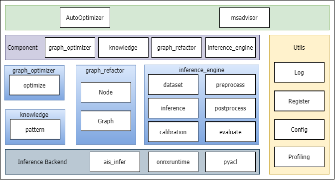

# auto-optimizer

## 介绍

自动调优工具，使能ONNX模型在昇腾芯片的优化，并提供基于ONNX的改图功能。

## 软件架构

软件架构说明



## 组件使用说明

- [x]  [graph_refactor](auto_optimizer/graph_refactor/README.md)
- [x]  [knowledge](docs/knowledge_optimizer_frame.md)
- [x]  [inference_engine](auto_optimizer/inference_engine/README.md)

## 安装教程

```shell
git clone https://github.com/Ascend/auto-optimizer.git
cd auto-optimizer
pip install -r requirements.txt
python setup.py install

```

## 许可证

[Apache License 2.0](LICENSE)

## 免责声明

auto-optimizer仅提高基于ONNX的改图及调优参考，不对其质量或维护负责。
如果您遇到了问题，Gitee/Ascend/auto-optimizer提交issue，我们将根据您的issue跟踪解决。
衷心感谢您对我们社区的理解和贡献。
