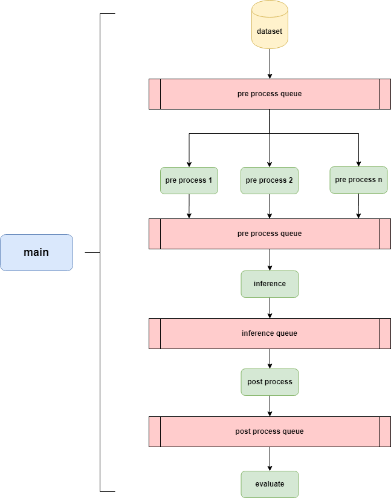

# 推理工具介绍

## 简介

inference.py工具实现了推理全流程的串接，全流程包含4个引擎，数据预处理、离线推理、后处理及精度评测，采用multiprocessing中多进程和队列机制实现，具体参考[inference.py](./inference.py)

推理引擎介绍参考：
[README.md](../inference_engine/README.md)

## 软件架构



## 工具使用

```shell
python tools/inference.py configs/cv/classification/example.py
```
