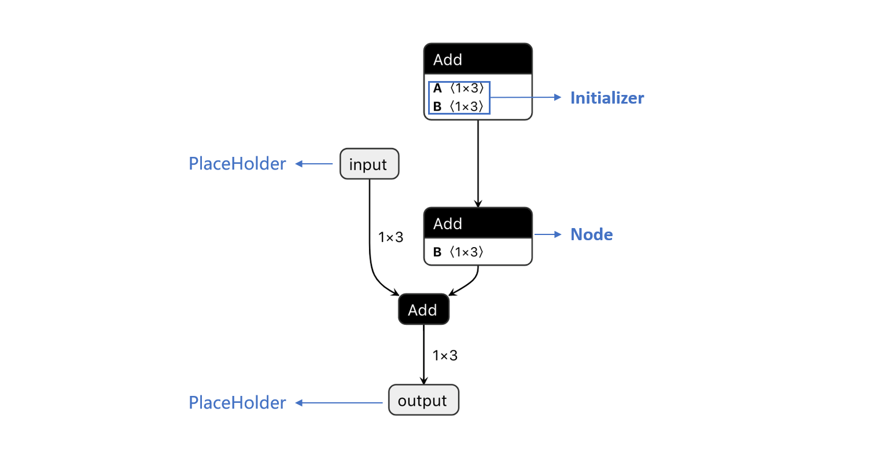

# BaseNode

## 概念定义

如图所示，BaseNode 的三个子类 PlaceHolder、Initializer 和 Node 覆盖了一个模型所包含的所有节点：

- PlaceHolder 整网输入输出节点
  - 可理解为占位符，因此具有属性 `shape` 和 `dtype`，不具有具体数值；
  - 在 onnx 框架中对应于 [onnx.proto3](https://gitee.com/link?target=https%3A%2F%2Fgithub.com%2Fonnx%2Fonnx%2Fblob%2Fmaster%2Fonnx%2Fonnx.proto3) 的 `ValueInfoProto`；

- Initializer 整网常量节点
  - 为具体常量（权重），因此具有属性 `value`；
  - 在 onnx 框架中对应于 [onnx.proto3](https://gitee.com/link?target=https%3A%2F%2Fgithub.com%2Fonnx%2Fonnx%2Fblob%2Fmaster%2Fonnx%2Fonnx.proto3) 的 `TensorProto` 和 [onnx 标准库算子](https://gitee.com/link?target=https%3A%2F%2Fgithub.com%2Fonnx%2Fonnx%2Fblob%2Fmaster%2Fdocs%2FOperators.md) 的 `Constant` 算子；
  
- Node 整网算子节点
  - 具有属性 `inputs` 和 `outputs`，用于确定网络的连边关系；
  - 具有属性 `attrs`，不同类型算子节点的属性参见 [onnx 标准库算子](https://gitee.com/link?target=https%3A%2F%2Fgithub.com%2Fonnx%2Fonnx%2Fblob%2Fmaster%2Fdocs%2FOperators.md)；
  - 在 onnx 框架中对应 [onnx.proto3](https://gitee.com/link?target=https%3A%2F%2Fgithub.com%2Fonnx%2Fonnx%2Fblob%2Fmaster%2Fonnx%2Fonnx.proto3) 的 `NodeProto` 。

## 相关操作

通过 [BaseGraph](./graph_refactor_BaseGraph.md) 获取特定节点后，可以获取和修改节点的相关信息。

| API 详细说明                                          | Operations               | API                                                          |
| ----------------------------------------------------- | ------------------------ | ------------------------------------------------------------ |
| [公共属性/方法](./graph_refactor_API.md#公共属性方法) | 获取节点名字             | node.name                                                    |
|                                                       | 修改节点名字             | node.name = 'new_name'                                       |
|                                                       | 获取节点类型             | node.op_type                                                 |
|                                                       | 打印节点信息             | print(node)                                                  |
| [常量节点](./graph_refactor_API.md#常量节点)          | 获取节点常量值           | ini.value                                                    |
|                                                       | 修改节点常量值           | Ini.value = np.array([1, 1, 1], dtype='int64')               |
|                                                       | 获取节点常量值的数据类型 | ini.value.dtype                                              |
|                                                       | 获取节点常量值的维度信息 | ini.value.shape                                              |
| [输入/输出节点](./graph_refactor_API.md#输入输出节点) | 获取节点数据类型         | ph.dtype                                                     |
|                                                       | 修改节点数据类型         | ph.dtype = np.dtype('float16')                               |
|                                                       | 获取节点维度信息         | ph.shape                                                     |
|                                                       | 修改节点维度信息         | ph.shape = [1, 3, 224, 224]                                  |
| [算子节点](./graph_refactor_API.md#算子节点)          | 获取节点输入列表         | op.inputs                                                    |
|                                                       | 获取节点输出列表         | op.outputs                                                   |
|                                                       | 修改节点输入列表         | op.inputs = ['input_0', 'input_1'] op.inputs[index] = ['input_name'] |
|                                                       | 修改节点输出列表         | op.outputs = ['output_0', 'output_1'] op.outputs[index] = ['output_name'] |
|                                                       | 获取节点某个输入下标     | op.get_input_id('input_1')                                   |
|                                                       | 获取节点某个输出下标     | op.get_output_id('output_1')                                 |
|                                                       | 获取节点属性             | op.attrs op['attr_x']                                   |
|                                                       | 修改、添加和删除节点属性 | op['attr_x'] = attr_x op['attr_new'] = attr_new op.pop('attr_x') |
