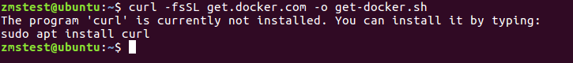
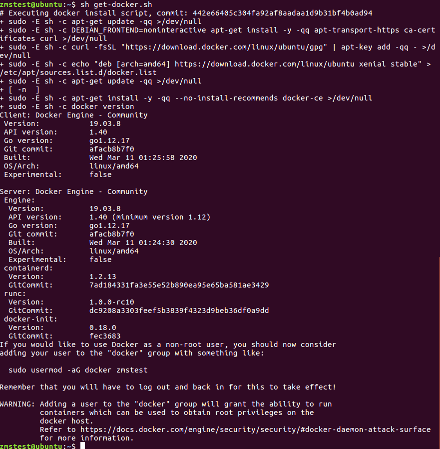
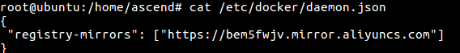
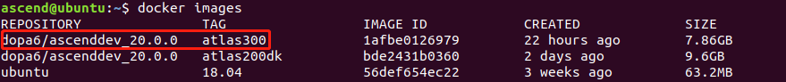

# docker镜像使用指导

该使用指导将指导你拉取一个C73 atlas300的全量级安装环境。环境内已经安装好了Mindstudio和ADK，用户直接打开Mindsutido即可使用。   
 **docker容器中普通用户用户名：ascend，密码：ascend    
            root用户用户名：root，密码：root**     
## 第一步：安装docker（如果已经安装docker可跳过该步骤）
1. 以普通用户在命令行中输入如下命令来获取安装docker的脚本。
   
    **curl -fsSL https://get.docker.com -o get-docker.sh**


    > **说明：**     
    >
    > -   如果命令失败，按照提示执行sudo apt install curl。若再次提示curl: (1) Protocol https not supported or disabled in libcurl报错，请输入apt-get update更新软件源。
    
    如[图 命令失败示意](#zh-cn_topic_1_1)所示：
    
    **图 1**  命令失败示意<a name="zh-cn_topic_1_1"></a>  
    
    
    **sh get-docker.sh**
    
    脚本执行成功如[图 执行成功示意](#zh-cn_topic_1_2)所示：
    
    **图 2**  执行成功示意<a name="zh-cn_topic_1_2"></a>  
    
    
    > **说明：**     
    >
    > -   如果安装失败，请进行[换源操作](#zh-cn_topic_2_2)，将本地源更换为清华源。

2. 安装成功后请在命令行中顺序执行如下指令将当前使用的普通用户添加到docker用户组内。

    **sudo groupadd docker**

    **sudo gpasswd -a ${USER} docker**

    **sudo service docker restart**

    **newgrp docker**

    -   _用户名_：当前使用的普通用户用户名，如ascend。
    
    > **注意：**     
    >
    > -   以上命令只需要执行一次，但是在打开新的终端使用普通用户执行docker指令时还是会报权限不足的错误，此时只要在新打开的终端下执行**newgrp docker**命令就可以了。

## 第二步：配置镜像加速（如果已经配置请跳过该步骤，这里用的是阿里云镜像加速，你也可以使用其他的镜像加速）
1. 命令行下顺序执行以下命令,使用Root用户创建/etc/docker/daemon.json文件。

    **su root**
    
    **vi /etc/docker/daemon.json**

2. 编辑/etc/docker/daemon.json内容为：

    ```
    {
     "registry-mirrors": ["https://bem5fwjv.mirror.aliyuncs.com"]
    }
    ```

    如[图 damon.json文件示意](#zh-cn_topic_1_3)所示：

    **图 3**  damon.json文件示意<a name="zh-cn_topic_1_3"></a>  
    

    修改完成后输入:wq!保存退出。

    > **注意：**     
    >
    > -   如果安装较慢，可以体验华为的镜像加速。如下所示：
    >   ```
    >   {
    >    "registry-mirrors": ["https://050670bd850026be0f43c0086d8b54a0.mirror.swr.myhuaweicloud.com"]
    >   }
    >   ```

3. 执行如下命令，退出root用户，并重启docker。

    **exit**

    **sudo systemctl daemon-reload**

    **sudo systemctl restart docker**

## 第三步：直接拉取atlas300开发环境镜像

命令行中执行如下命令拉取镜像：
    
**docker pull dopa6/ascenddev_20.0.0:atlas300**


## 第四步：配置开发环境

1. 用如下命令查看下载的镜像，可以看到你刚才下载的镜像ID.如[图 镜像查看示意](#zh-cn_topic_1_6)所示。

    **docker images**

    **图 6**  镜像查看示意<a name="zh-cn_topic_1_6"></a>  
    

2. 用如下命令创建容器，镜像ID替换为你查到的。

    >   docker run -t -i --privileged -v \\$HOME/.Xauthority:/root/.Xauthority --net=host -e DISPLAY=\\$DISPLAY  
   [ImageID]

    -   ImageID：需要运行的镜像ID。
    -   --net=host： 表示使用主机的网络。
    -   -v /dev:/dev：docker中挂载主机对应目录，也相当于共享文件夹。其余-v参数含义一致。
    -   -e：传递环境变量，其余-e参数含义一致。
    此指导中镜像image如上图为038b3189b4f0，则命令执行示例如下：

    >   docker run -t -i --privileged -v \\$HOME/.Xauthority:/root/.Xauthority --net=host -e DISPLAY=\\$DISPLAY 1afbe0126979

    命令执行后即可进入容器。

    > **说明：**     
    >
    > -   该命令只是在创建容器时运行一次即可，后面在进入容器无需这么复杂的命令。

## 

## 常用操作

1. <a name="zh-cn_topic_2_2"></a>**换源操作**

    1. 命令行执行以下命令，备份原来的更新源

        **cp /etc/apt/sources.list /etc/apt/sources.list.backup**

    2. 修改更新源　

        打开sources.list (这就是存放更新源的文件)。

        **gedit /etc/apt/sources.list**
        
        将下面所有内容复制，粘贴并覆盖sources.list文件中的所有内容，覆盖后保存。
        
        \# deb cdrom:[Ubuntu 16.04 LTS _Xenial Xerus_ - Release amd64 (20160420.1)]/ xenial main restricted
        
        deb http://mirrors.tuna.tsinghua.edu.cn/ubuntu/ xenial main restricted
    
        deb http://mirrors.tuna.tsinghua.edu.cn/ubuntu/ xenial-updates main restricted

        deb http://mirrors.tuna.tsinghua.edu.cn/ubuntu/ xenial universe

        deb http://mirrors.tuna.tsinghua.edu.cn/ubuntu/ xenial-updates universe

        deb http://mirrors.tuna.tsinghua.edu.cn/ubuntu/ xenial multiverse

        deb http://mirrors.tuna.tsinghua.edu.cn/ubuntu/ xenial-updates multiverse

        deb http://mirrors.tuna.tsinghua.edu.cn/ubuntu/ xenial-backports main restricted universe multiverse

        deb http://mirrors.tuna.tsinghua.edu.cn/ubuntu/ xenial-security main restricted

        deb http://mirrors.tuna.tsinghua.edu.cn/ubuntu/ xenial-security universe

        deb http://mirrors.tuna.tsinghua.edu.cn/ubuntu/ xenial-security multiverse

    3. 让更新源生效

        sudo apt-get update

2. **docker常用操作指令集**

    1. 如何查看镜像。
       
        **docker images**

    2. 如何创建容器。

        有了镜像以后，可通过docker run命令创建容器，在本应用场景下创建容器指令如下。

        **docker run -t -i --privileged -v \\$HOME/.Xauthority:/root/.Xauthority --net=host -e DISPLAY=\\$DISPLAY  
   [ImageID]**

    3. 如何退出容器。
       
        在容器中，使用exit指令退出容器，但是如果是docker run命令进入的容器，则退出后容器就会停止。
    
    4. 如何查看容器

        查看所有容器，包括已经停止的容器
        
        **docker ps -a**

        查看正在运行的容器

        **docker ps**

    5. 如何进入容器

        - docker run 命令创建完容器，exit后，请用如下的方式进入。
        
            命令行中使用如下指令查看你刚才退出的容器ID

            **docker ps -a**

            执行如下指令启动容器，容器ID要替换为你查到的CONTATNER_ID。

            **docker start 容器ID**

            继续执行如下指令，进入容器，容器ID要替换为你查到的CONTATNER_ID。

            **docker exec -it 容器ID /bin/bash**

        - docker exec方式进入容器，exit后，容器并不会停止，下次进入仍然使用docker exec方式进入即可

            命令行中使用如下指令查看你刚才退出的容器ID

            **docker ps -a**

            执行如下指令，进入容器，容器ID要替换为你查到的CONTATNER_ID。

            **docker exec -it 容器ID /bin/bash**

    6. 如何停止容器。

        **docker stop 容器ID**

    7. 如何启动容器。

        **docker start 容器ID**

    8. 如何删除容器。

        需要在容器停止的时候才可以删除。
        
        **docker rm 容器ID**

    9. 如何删除镜像。

        需要在镜像创建的所有容器都停止的情况下才可以删除。
        
        **docker rmi 镜像ID**
    
    10. 如何将主机中的数据拷贝到容器中。

        **docker cp 主机文件路径 容器ID:/容器中存放数据的目录**
        
    11. 如何清理docker内存。

        以下分别进行容器清理、镜像清理、volumes目录清理。

        **docker ps --filter status=dead --filter status=exited -aq | xargs -r docker rm -v**

        **docker images --no-trunc | grep '<none>' | awk '{ print $3 }' | xargs -r docker rmi**

        **docker volume ls -f dangling=true | awk '{ print $2 }' | xargs docker volume rm**

## 参考资料

1. docker中文入门手册

    http://www.docker.org.cn/book/docker/what-is-docker-16.html

2. docker官方快速入门

    https://docs.docker.com/get-started/

3. 昇腾社区官网

    https://www.huaweicloud.com/ascend

4. 昇腾社区Atlas200DK板块论坛

    https://bbs.huaweicloud.com/forum/forum-949-1.html


