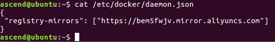
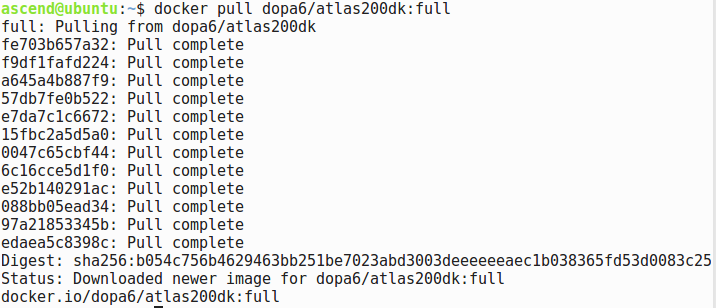
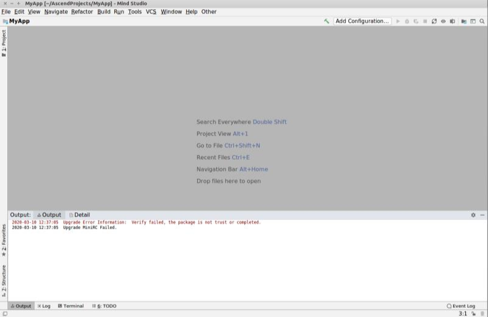
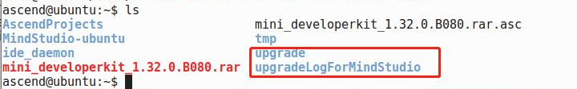
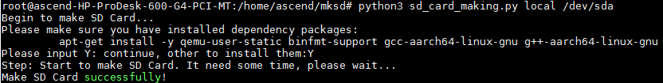
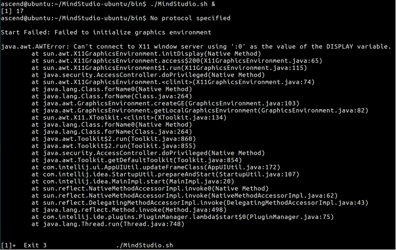
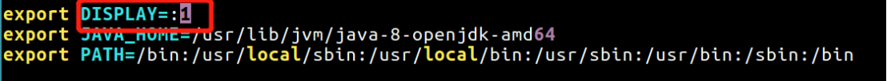

English|[中文](readme.md)

# atlas200dk\_full<a name="EN-US_TOPIC_0235607832"></a>

This section describes how to install a full Atlas 200 DK environment using an image. Mind Studio and DDK have been installed in this environment. You can start Mind Studio directly.

The image size is 5.23 GB. This version is recommended if you have good network connection.     
 **There is no normal user in the Docker container, and the user sets it by himself.The root password can be changed by using passwd root.**        

## Installing Docker<a name="en-us_topic_0233774133_section644615175186"></a>

Skip this step if Docker has been installed.

1.  Run the following commands as a common user to obtain the Docker installation script:

    **curl -fsSL get.docker.com -o get-docker.sh**

    **sh get-docker.sh**

    > **NOTE:**   
    >If the installation fails, replace the local sources with Tsinghua sources by referring to  [3](#en-us_topic_0233774133_li5915221101512).  

2.  After the installation is successful, run the following commands in sequence in the command line to add the common user to the Docker user group:

    **sudo groupadd docker**

    **sudo gpasswd -a ${USER} docker**

    **sudo service docker restart**

    **newgrp docker**

    -   Replace  _**username**_  with the actual user name of the common user, for example,  **ascend**.

    > **NOTE:**   
    >-   You need to run the preceding commands only once.  
    >-   When a common user runs the docker commands in a new terminal window, an error indicating insufficient permission is reported. To fix this error, run the** newgrp docker**  command in the new terminal window.  


## Configuring Image Acceleration<a name="en-us_topic_0233774133_section1092732020254"></a>

Skip this step if you have configured the image acceleration. Here, the image acceleration method provided by Alibaba Cloud is used. You can also use other image acceleration methods.

1.  Create the  **/etc/docker/daemon.json**  file as the  **root** user.

    **su root**

    **vi /etc/docker/daemon.json**

2.  Edit the  **/etc/docker/daemon.json**  file as follows:

    ```
    {
     "registry-mirrors": ["https://bem5fwjv.mirror.aliyuncs.com"]
    }
    ```

    See  [Figure 1](#en-us_topic_0233774133_fig3888158162810).

    **Figure  1**  Content of damon.json<a name="en-us_topic_0233774133_fig3888158162810"></a>  
    

    After the modification, enter  **:wq**  and press  **Enter**  to save the configuration and exit.

    > **NOTE:**   
    >If the installation is slow, you can use the image acceleration method of Huawei.  
    >```  
    >{  
    > "registry-mirrors": ["https://050670bd850026be0f43c0086d8b54a0.mirror.swr.myhuaweicloud.com"]  
    >}  
    >```  

3.  Run the following commands to exit the  **root** user and restart Docker:

    **exit**

    **sudo systemctl daemon-reload**

    **sudo systemctl restart docker**


## Image Obtaining<a name="en-us_topic_0233774133_section09444207252"></a>

Use the  **dockerfile** file to create an image on the local disk or directly pull the Atlas 200 DK development environment image.

-   Run the following command to pull the Atlas 200 DK environment image.

    [Figure 2](#en-us_topic_0233774133_fig1848461843419)  shows the command output.

    **docker pull dopa6/atlas200dk:atlas200dk_full_root_user**

    **Figure  2**  Pulling image<a name="en-us_topic_0233774133_fig1848461843419"></a>  
    

-   Create an image using the  **dockerfile** file on the local disk.
    1.  Run the following commands in sequence to download the files in the  **dockerimages** repository:

        **cd $HOME**

        **git clone https://gitee.com/lovingascend/dockerimages.git**

    2.  Run the following commands to execute the script in the  **atlas200dk\_full** folder to prepare the environment:

        **cd dockerimages/atlas200dk\_full**

        **bash dockerimageprepare.sh**

    3.  Run the following command to build the image in the directory of the  **dockerfile**  file:

        **docker build -t** _REPOSITORY:TAG_ **.**

        -   _REPOSITORY_: image repository name
        -   _TAG_: image tag

        A command example is provided as follows:

        **docker build -t dopa6/atlas200dk:atlas200dk_full_root_user .**

        > **NOTE:**   
        >If the build fails and the error message "The command'xxx' returned ann-zero code:100" is displayed, the possible cause is unstable network connection. To fix the error, replace the local sources with Tsinghua sources by referring to  [3](#en-us_topic_0233774133_li5915221101512).  


## Configuring the Development Environment<a name="en-us_topic_0233774133_section1162195913213"></a>

1.  <a name="en-us_topic_0233774133_li8248616124114"></a>Run the following command to view the downloaded image, including the image ID, as shown in  [Figure 3](#en-us_topic_0233774133_fig386119137427).

    **docker images**

    **Figure  3**  Viewing downloaded Image<a name="en-us_topic_0233774133_fig386119137427"></a>  
    

2.  Run the following command to create a container. Replace the image ID with the ID obtained in step  [1](#en-us_topic_0233774133_li8248616124114).

    **docker run -t -i --privileged --network=host -v \\$HOME/.Xauthority:/root/.Xauthority -v /dev:/dev -v /tmp:/tmp -e DISPLAY=\\$DISPLAY --name=[容器别名]** ImageID

    -   _ImageID_: ID of the image to be run
    -   **--network=host**: Specifies the network of the host.
    -   **-v /dev:/dev**: mounted directory of Docker on the host, which is a shared folder \(same for other arguments prefixed with  **-v**\)
    -   **-e GDK\_SCALE**: environment variable to be passed \(same for other arguments prefixed with  **-e**\)

    In this example, the image ID is  **f0d55a797534**. The command output is as follows:

    **docker run -t -i --privileged --network=host -v /tmp/.X11-unix:/tmp/.X11-unix -v /dev:/dev -v /tmp:/tmp -e DISPLAY=unix$DISPLAY -e GDK\_SCALE -e GDK\_DPI\_SCALE f0d55a797534**

    After the command is executed, access the container.

    > **NOTE:**   
    >This command only needs to be run once to create a container.  

3.  The network environment of the container is the same as that of the external host machine \(the user's development machine\). You can configure the host machine network to connect to the developer board by referring to the following link:

    [https://www.huaweicloud.com/ascend/doc/Atlas200DK/1.31.0.0\(beta\)/zh/zh-cn\_topic\_0182634998.html](https://www.huaweicloud.com/ascend/doc/Atlas200DK/1.31.0.0(beta)/zh/zh-cn_topic_0182634998.html)


## Setting up the Mind Studio environment.<a name="en-us_topic_0233774133_section193474593409"></a>

1.  Start Mind Studio.

    In the Docker environment, run the following commands as a common user:

    **cd \~/Mindstudio/bin**

    **./Mindstudio.sh**

2.  Configure the DK.

    Configure the DK by referring to the following link:

    [https://www.huaweicloud.com/ascend/doc/mindstudio/2.1.0\(beta\)/zh/zh-cn\_topic\_0200347922.html](https://www.huaweicloud.com/ascend/doc/mindstudio/2.1.0(beta)/zh/zh-cn_topic_0200347922.html)

3.  Upgrade the DK.

    Upgrade the DK by referring to the following link. Fix common errors by referring to  [1](#en-us_topic_0233774133_li179158219153).

    [https://www.huaweicloud.com/ascend/doc/Atlas200DK/1.31.0.0\(beta\)/zh/zh-cn\_topic\_0182634979.html](https://www.huaweicloud.com/ascend/doc/Atlas200DK/1.31.0.0(beta)/zh/zh-cn_topic_0182634979.html)

    You can also perform manual upgrade by referring to the following link \(in the case of an upgrade failure\):

    [https://www.huaweicloud.com/ascend/doc/mindstudio/2.1.0\(beta\)/zh/zh-cn\_topic\_0200348044.html](https://www.huaweicloud.com/ascend/doc/mindstudio/2.1.0(beta)/zh/zh-cn_topic_0200348044.html)

4.  Synchronize the library files by referring to the following link:

    [https://www.huaweicloud.com/ascend/doc/mindstudio/2.1.0\(beta\)/zh/zh-cn\_topic\_0201537270.html](https://www.huaweicloud.com/ascend/doc/mindstudio/2.1.0(beta)/zh/zh-cn_topic_0201537270.html)


## Hands-on with Your First Application<a name="en-us_topic_0233774133_section83600594401"></a>

Build your first application by referring to the following link:

[https://www.huaweicloud.com/ascend/doc/mindstudio/2.1.0\(beta\)/zh/zh-cn\_topic\_0200347819.html](https://www.huaweicloud.com/ascend/doc/mindstudio/2.1.0(beta)/zh/zh-cn_topic_0200347819.html)

> **NOTE:**   
>If you need to upgrade the developer board, see  [1](#en-us_topic_0233774133_li179158219153).  

## Common Operations<a name="en-us_topic_0233774133_section04324149526"></a>

1.  <a name="en-us_topic_0233774133_li179158219153"></a>Upgrade the DK.

    Upgrade the DK in Mind Studio in the Docker environment. The error shown in  [Figure 4](#en-us_topic_0233774133_fig13358544564)  might be displayed.

    **Figure  4**  DK upgrade failed<a name="en-us_topic_0233774133_fig13358544564"></a>  
    

    Two directories are displayed in the command line, as shown in the following figure.

    

    Run the following commands to go to the  **$HOME/upgrade/scripts**  directory and open the **import\_publickey.sh**  script:

    **cd $HOME/upgrade/scripts**

    **gedit import\_publickey.sh**

    Change the following statement:

    ```
    script -c 'echo -e "5\ny\n" | gpg --command-fd 0 --edit-key "OpenPGP signature key for Huawei" trust'
    ```

    to:

    ```
    echo -e "5\ny\n" | gpg --command-fd 0 --edit-key  "OpenPGP signature key for Huawei" trust
    ```

    Run the  **wq!** command to save the change and exit. Run the following command to execute the script:

    **bash import\_publickey.sh**

    Start Mind Studio and try to upgrade the DK again.

2.  Make the SD card in Docker.
    1.  Insert the SD card to the SD card reader and connect the reader to the host. Then, connect to the target VM. \(Skip this step on Linux.\)
    2.  Log in to the host in an environment other than Docker as the  **root** user and run the following commands to query the name and partitions of the USB device corresponding to the SD card:

        **su root**

        **fdisk -l**

        Assume that the name of the USB device is  **/dev/sda**  and the device has only one partition** /dev/sda1**.

    3.  Unmount the partition on the host and exit the  **root** user.

        **umount /dev/sda1**

        **exit**

    4.  You can make cards by following the normal card making steps in docker. You can follow the steps below.

        1. Get Ubuntu operating system image package.

            - Developer board operating system image package, requires Ubuntu version 16.04.3, development board system mirror package name: ubuntu-16.04.3-server-arm64.iso, please go to http://old-releases.ubuntu.com/ releases / 16.04.3 / website download the corresponding version of the software.

              > **NOTE:**   
              > Ubuntu Package type needs to select "arm64", "server" version.  

            - Query the ID of the container opened by docker image dopa6 / atlas200dk: full.

              *Figure  5*  Query Container ID<a name="en-us_topic_1_fig1"></a>  
              

              As shown in the [Figure 5](#en-us_topic_1_fig1), the opened container ID is **2b0c671945c0**.
              
            - Go to the directory where the ubuntu-16.04.3-server-arm64.iso file is stored and execute the following command:
              
              **docker cp ./ubuntu-16.04.3-server-arm64.iso 2b0c671945c0:/home/ascend/mksd/**
        
        2. Enter the container, switch to the root user and enter the directory / home / ascend / mksd where the card making script is located.

            **su root**

            **cd /home/ascend/mksd**

        3. Execute card making script.

            - Run the following command to find the name of the device where the SD card is located.

              **fdisk -l**

              For example, the name of the USB device where the SD card is located is "/ dev / sda".

            - Run the SD card script "make_sd_card.py".

              **python3 make_sd_card.py local /dev/sda**

              - "local" means use local method to make SD card.

              - "/ dev / sda" is the name of the USB device where the SD card is located.

            As shown in the [Figure 6](#en-us_topic_1_fig1), the card making is successful.

            *Figure  6* Business card success diagram<a name="en-us_topic_1_fig2"></a>  
            
            
            > **NOTE:**   
            > If the card making fails, you can view the log files in the sd_card_making_log folder in the current directory for analysis.

3.  <a name="en-us_topic_0233774133_li5915221101512"></a>Replace update sources.
    1.  Back up the original update sources:

        **cp /etc/apt/sources.list /etc/apt/sources.list.backup**

        In the case of insufficient permission, run the following commands to switch to the  **root** user and back up the original update source:

        **sudo -s**

        **cp /etc/apt/sources.list /etc/apt/sources.list.backup**

    2.  Overwrite the update sources.

        Open the source list file  **sources.list**.

        **gedit /etc/apt/sources.list**

        Overwrite the  **sources.list**  file with the following content, and save the file.

        ```
        \# deb cdrom:[Ubuntu 16.04 LTS _Xenial Xerus_ - Release amd64 (20160420.1)]/ xenial main restricted
        deb http://mirrors.tuna.tsinghua.edu.cn/ubuntu/ xenial main restricted
        deb http://mirrors.tuna.tsinghua.edu.cn/ubuntu/ xenial-updates main restricted
        deb http://mirrors.tuna.tsinghua.edu.cn/ubuntu/ xenial universe
        deb http://mirrors.tuna.tsinghua.edu.cn/ubuntu/ xenial-updates universe
        deb http://mirrors.tuna.tsinghua.edu.cn/ubuntu/ xenial multiverse
        deb http://mirrors.tuna.tsinghua.edu.cn/ubuntu/ xenial-updates multiverse
        deb http://mirrors.tuna.tsinghua.edu.cn/ubuntu/ xenial-backports main restricted universe multiverse
        deb http://mirrors.tuna.tsinghua.edu.cn/ubuntu/ xenial-security main restricted
        deb http://mirrors.tuna.tsinghua.edu.cn/ubuntu/ xenial-security universe
        deb http://mirrors.tuna.tsinghua.edu.cn/ubuntu/ xenial-security multiverse
        ```

    3.  Make the new source list take effect.

        **sudo apt-get update**

    4.  Troubleshooting

        ```
        *** Error in `appstreamcli': double free or corruption (fasttop): 0x000000000237b000 ***
        ```

        Run the following command to fix the error. Alternatively, restore the backup sources and overwrite the sources again.

        **sudo apt-get purge libappstream3**

        Run the** sudo apt-get update **command again.

4.  Common Docker commands
    1.  View the image.

        **docker images**

    2.  Create a container.

        With an available image, you can run the following  **docker run**  command to create a container:

        **docker run -t -i --privileged --network=host -v /tmp/.X11-unix:/tmp/.X11-unix -v /dev:/dev -v /tmp:/tmp -e DISPLAY=unix$DISPLAY -e GDK\_SCALE -e GDK\_DPI\_SCALE  _ImageID_**

    3.  Exit the container.

        In the container, run the following command to exit the container. If the container is accessed by running the  **docker run**  command, the container stops after the exit.

        **exit**

    4.  View containers.

        View all containers, including stopped ones:

        **docker ps -a**

        View running containers:

        **docker ps**

    5.  Access a container.
        -   Run the  **docker run**  command to create a container. After the container is exited, run the following command to access the container:

            Run the following command to query the ID of the container that you exit:

            **docker ps -a**

            Run the following command to start a container.

            **docker start  _CONTATNER\_ID_**

            Run the following command to access the container.

            **docker exec -it  _CONTATNER\_ID_  /bin/bash**

        -   If a container is accessed by running the  **docker exec**  command, the container does not stop after exit. Run the** docker exec**  command to access the container next time.

            Run the following command to query the ID of the container that you exit:

            **docker ps -a**

            Run the following command to access the container.

            **docker exec -it  _CONTATNER\_ID_  /bin/bash**

    6.  Stop a container.

        **docker stop** **_CONTATNER\_ID_**

    7.  Start a container.

        **docker start  _CONTATNER\_ID_**

    8.  Remove a container.

        A container can be removed only when it is stopped.

        **docker rm  _CONTATNER\_ID_**

    9.  Remove an image.

        An image can be removed only when all containers created using the image are stopped.

        **docker rmi  _ImageID_**

    10. How to copy data from the host to the container.

        **docker cp _Hostfilepath_ _CONTATNER\_ID:/CONTATNERfilepath_**

    11. Clear the Docker memory.

        Run the following commands to remove containers, images, and volumes.

        **docker ps --filter status=dead --filter status=exited -aq | xargs -r docker rm -v**

        **docker images --no-trunc | grep '<none\>' | awk '\{ print $3 \}' | xargs -r docker rmi**

        **docker volume ls -f dangling=true | awk '\{ print $2 \}' | xargs docker volume rm**


## FAQs<a name="en-us_topic_0233774133_section04445146529"></a>

1.  What do I do if "No protocol specified" is displayed when starting Mind Studio?

    Start Failed: Failed to initialize graphics environment

    java.awt.AWTError: Can't connect to X11 window server using ':0' as the value of the DISPLAY variable.

    The following figure shows the error messages.

    

    **Solution**

    Change the value of the  **DISPLAY **variable in  **\~/.bashrc**  to** 1**.

    

    Run the  **source** command again to make the environment variable take effect and restart Mind Studio. If the problem persists, change the display configuration.

    vi \~/.bashrc

    source \~/.bashrc


## See Also<a name="en-us_topic_0233774133_section12887143514339"></a>

1.  Docker Get Started

    [https://docs.docker.com/engine/docker-overview/](http://www.docker.org.cn/book/docker/what-is-docker-16.html)

    [https://docs.docker.com/get-started/](https://docs.docker.com/get-started/)

2.  Ascend Developer Zone

    [https://www.huaweicloud.com/ascend](https://www.huaweicloud.com/ascend)

3.  Atlas 200 DK Forum

    [https://bbs.huaweicloud.com/forum/forum-949-1.html](https://bbs.huaweicloud.com/forum/forum-949-1.html)


