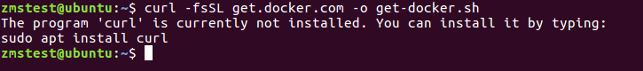
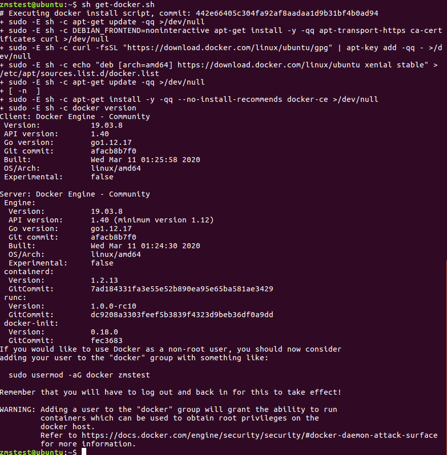
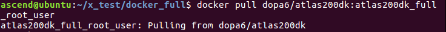
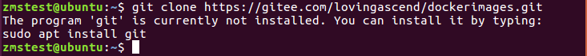
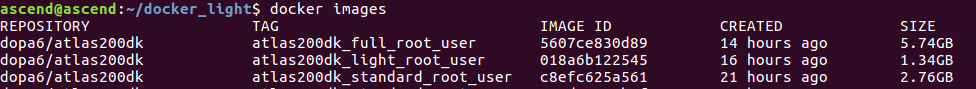
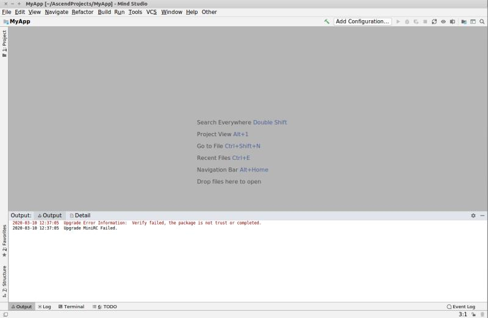
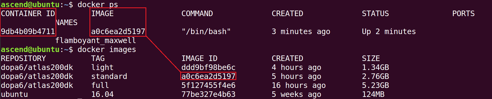

中文|[English](Readme_EN.md)

# docker镜像使用指导-全量级

该使用指导将指导你拉取一个atlas200dk的全量级安装环境。环境内已经安装好了Mindstudio和DDK，用户直接打开Mindsutido即可使用。

由于该镜像包内已经解压安装好了软件，所以镜像较大，为5.23G。适用于网络状况较好的用户。   
**docker容器内没有普通用户，用户根据自己选择设置。    
root用户密码通过passwd root来修改**     

## 第一步：安装docker（如果已经安装docker可跳过该步骤）
1. 以普通用户在命令行中输入如下命令来获取安装docker的脚本。
   
    **curl -fsSL https://get.docker.com -o get-docker.sh**


    > **说明：**     
    >
    > -   如果命令失败，按照提示执行sudo apt install curl。若再次提示curl: (1) Protocol https not supported or disabled in libcurl报错，请输入apt-get update更新软件源。

    如[图 命令失败示意](#zh-cn_topic_1_1)所示：

    **图 1**  命令失败示意<a name="zh-cn_topic_1_1"></a>  
    

    **sh get-docker.sh**

    脚本执行成功如[图 执行成功示意](#zh-cn_topic_1_2)所示：

    **图 2**  执行成功示意<a name="zh-cn_topic_1_2"></a>  
    

    > **说明：**     
    >
    > -   如果安装失败，请进行[换源操作](#zh-cn_topic_2_2)，将本地源更换为清华源。

2. 安装成功后请在命令行中顺序执行如下指令将当前使用的普通用户添加到docker用户组内。

    **sudo groupadd docker**

    **sudo gpasswd -a ${USER} docker**

    **sudo service docker restart**

    **newgrp docker**

    -   _用户名_：当前使用的普通用户用户名，如ascend。
    
    > **注意：**     
    >
    > -   以上命令只需要执行一次，但是在打开新的终端使用普通用户执行docker指令时还是会报权限不足的错误，此时只要在新打开的终端下执行**newgrp docker**命令就可以了。

## 第二步：配置镜像加速（如果已经配置请跳过该步骤，这里用的是阿里云镜像加速，你也可以使用其他的镜像加速）
1. 命令行下顺序执行以下命令,使用Root用户创建/etc/docker/daemon.json文件。

    **su root**
    
    **vi /etc/docker/daemon.json**

2. 编辑/etc/docker/daemon.json内容为：

    ```
    {
     "registry-mirrors": ["https://bem5fwjv.mirror.aliyuncs.com"]
    }
    ```

    如[图 damon.json文件示意](#zh-cn_topic_1_3)所示：

    **图 3**  damon.json文件示意<a name="zh-cn_topic_1_3"></a>  
    

    修改完成后输入:wq!保存退出。

    > **注意：**     
    >
    > -   如果安装较慢，可以体验华为的镜像加速。如下所示：
    >   ```
    >   {
    >    "registry-mirrors": ["https://050670bd850026be0f43c0086d8b54a0.mirror.swr.myhuaweicloud.com"]
    >   }
    >   ```

3. 执行如下命令，退出root用户，并重启docker。

    **exit**

    **sudo systemctl daemon-reload**

    **sudo systemctl restart docker**

## 第三步：本地通过dockerfile创建镜像或直接拉取atlas200dk开发环境镜像（选择下列方法其中之一得到镜像即可)
1. 拉取atlas200DK开发环境镜像。
   
    命令行中执行如下命令拉取镜像，如[图 拉取镜像示意](#zh-cn_topic_1_4)所示：
    
    **docker pull dopa6/atlas200dk:atlas200dk_full_root_user**

    **图 4**  拉取镜像示意<a name="zh-cn_topic_1_4"></a>  
    

2. 本地通过dockerfile创建镜像。 

    1. 命令行下顺序执行以下命令，下载dockerimages仓中的文件。

        **cd $HOME**

        **git clone https://gitee.com/lovingascend/dockerimages.git**

    > **说明：**     
    >
    > -   若环境未安装git，请输入命令sudo apt install git先安装git。

    若环境未安装git如[图 未安装git示意](#zh-cn_topic_1_5)所示：

    **图 5**  未安装git示意<a name="zh-cn_topic_1_5"></a>  
    

    2. 继续执行以下命令，在atlas200dk_full文件夹下执行脚本进行环境准备。

        **cd dockerimages/atlas200dk_full**

        **bash dockerimageprepare.sh**

    3. 继续顺序执行以下命令，在docerfile同级目录下build镜像。

        **docker build -t** _REPOSITORY:TAG_ **.**
        
        -   _REPOSITORY_：镜像仓库名。

        -   _TAG_：镜像标签。

        命令执行示例如下：

        **docker build -t dopa6/atlas200dk:full .**
        
        > **注意：**     
        >
        > -   如果build失败，报错为The command ‘xxx’ returned ann-zero code:100，可能是网络不稳定，可以执行[换源操作](#zh-cn_topic_2_2)，更换清华源重新build。

## 第四步：配置开发环境

1. 用如下命令查看下载的镜像，可以看到你刚才下载的镜像ID.如[图 镜像查看示意](#zh-cn_topic_1_6)所示。

    **docker images**

    **图 6**  镜像查看示意<a name="zh-cn_topic_1_6"></a>  
    

2. 用如下命令创建容器，镜像ID替换为你查到的。

    **docker run -t -i --privileged --network=host -v \\$HOME/.Xauthority:/root/.Xauthority -v /dev:/dev -v /tmp:/tmp -e DISPLAY=\$DISPLAY --name=[容器别名]** _ImageID_

    -   _ImageID_：需要运行的镜像ID。
    -   --network=host： 表示使用主机的网络。
    -   -v /dev:/dev：docker中挂载主机对应目录，也相当于共享文件夹。其余-v参数含义一致。
    -   -e GDK_SCALE：传递环境变量，其余-e参数含义一致。
    -   -name：为容器创建别名，下次启动或进入容器时可直接使用这个别名。
    此指导中镜像image如上图为**5607ce830d89**，则命令执行示例如下：

    **docker run -t -i --privileged --network=host -v \\$HOME/.Xauthority:/root/.Xauthority -v /dev:/dev -v /tmp:/tmp -e DISPLAY=\\$DISPLAY --name=atlas200dkuser 5607ce830d89**

    命令执行后即可进入容器。

    > **说明：**     
    >
    > -   该命令只是在创建容器时运行一次即可，后面在进入容器无需这么复杂的命令。

3. 此容器内的网络环境与外界宿主机(host)一样，参考如下链接的官方文档配置宿主机网络可以与开发板联通。

    [https://www.huaweicloud.com/ascend/doc/Atlas200DK/1.31.0.0(beta)/zh/zh-cn_topic_0182634998.html](https://www.huaweicloud.com/ascend/doc/Atlas200DK/1.31.0.0(beta)/zh/zh-cn_topic_0182634998.html)

## 第五步 参考官方文档打开MindStudio，在MindStuduio中添加开发板，同步Lib库，开发环境搭建完毕。

1. 打开Mindstudio

    docker环境中普通用户在命令行执行以下命令，打开Mindstudio。

    **cd ~/Mindstudio/bin**

    **./Mindstudio.sh**

2. 配置开发板

    请参考如下链接，完成开发板配置，添加你刚才已经链接上的开发板。

    https://www.huaweicloud.com/ascend/doc/mindstudio/2.1.0(beta)/zh/zh-cn_topic_0200347922.html 

3. 开发板升级

    请参考如下链接完成开发板升级，升级过程中可能会有报错，请参考常用操作中的[开发板升级](#zh-cn_topic_2_1)操作。

    https://www.huaweicloud.com/ascend/doc/Atlas200DK/1.31.0.0(beta)/zh/zh-cn_topic_0182634979.html

    如果升级失败，请参考如下链接用手工方式升级。

    https://www.huaweicloud.com/ascend/doc/mindstudio/2.1.0(beta)/zh/zh-cn_topic_0200348044.html

4. 同步lib库 

    https://www.huaweicloud.com/ascend/doc/mindstudio/2.1.0(beta)/zh/zh-cn_topic_0201537270.html

## 第六步：体验第一个案例

直接按照如下指导书一步步完成即可.

[https://www.huaweicloud.com/ascend/doc/mindstudio/2.1.0(beta)/zh/zh-cn_topic_0200347819.html](https://www.huaweicloud.com/ascend/doc/mindstudio/2.1.0(beta)/zh/zh-cn_topic_0200347819.html)
    
> **说明：**     
>
> -   如果需要升级开发板，请参考常用操作中的[开发板升级](#zh-cn_topic_2_1)或参考官方文档制卡进行开发板升级。

## 常用操作

1. <a name="zh-cn_topic_2_1"></a>**开发板升级**

    Docker下的mindstuido升级开发板，升级时报错如[图 开发板升级失败](#zh-cn_topic_1_7)所示。

    **图 7**  开发板升级失败<a name="zh-cn_topic_1_7"></a>  
    

    此时命令行会生成下图所示的两个目录。

    

    命令行中执行如下命令，进入$HOME/upgrade/scripts目录，进入import_publickey.sh脚本

    **cd $HOME/upgrade/scripts**
    
    **gedit import_publickey.sh**

    将以下语句

    ```
    script -c ‘echo -e "5\ny\n" | gpg --command-fd 0 --edit-key  "OpenPGP signature key for Huawei" trust’
    ```
    修改为
    
    ```
    echo -e "5\ny\n" | gpg --command-fd 0 --edit-key  "OpenPGP signature key for Huawei" trust
    ```

    输入：wq！保存退出后，命令行下输入以下命令执行脚本。
    
    **bash import_publickey.sh**

    执行后再打开Mindstudio升级开发板即可

2. **docker下制卡**

    1. 将SD卡放置在读卡器上，插入主机并连接到虚拟机（Liunx系统中可以忽略）

    2. 主机侧（非docker环境下）登录root用户，使用如下指令查找SD卡所在的USB设备名称及分区情况。

        **su root**

        **fdisk -l**

        例如，SD卡所在USB设备名称为“/dev/sda”，分区只有一个，为/dev/sda1。

    3. 主机侧umount所有分区并退出root用户。

        **umount /dev/sda1**

        **exit**

    4. docker中按照正常制卡步骤即可制卡，可按照如下步骤操作。

        1. 获取Ubuntu操作系统镜像包
        
           - 开发者板操作系统镜像包，要求Ubuntu版本为16.04.3，开发板系统镜相包名：ubuntu-16.04.3-server-arm64.iso，请从[http://old-releases.ubuntu.com/releases/16.04.3/](http://old-releases.ubuntu.com/releases/16.04.3/)网站下载对应版本软件。
        
             > Ubuntu Package类型需要选择“arm64”、"server"版本
        
           - 查询docker镜像dopa6/atlas200dk:full开启的容器的ID
        
             **图8** 查询容器ID<a name="zh-cn_topic_1_8"></a> 
        
             
        
             如[图 查询容器ID](#zh-cn_topic_1_8)所示，开启的容器ID为**2b0c671945c0**
        
           - 进入到存放ubuntu-16.04.3-server-arm64.iso文件的目录下，执行如下命令：
        
             **docker cp  ./ubuntu-16.04.3-server-arm64.iso  2b0c671945c0:/home/ascend/mksd/**
        
        2. 进入容器中，切换到root用户并进入制卡脚本所在的目录2./root/mksd
        
           **su root**
        
           **cd /home/ascend/mksd**
        
        3. 执行制卡脚本
        
           - 执行如下命令查找SD卡所在设备的名称
        
             **fdisk -l**
        
             例如，SD卡所在的USB设备名称为"/dev/sda"
        
           - 运行SD制卡脚本"**make_sd_card.py**"
        
             ​		**python3 make_sd_card.py local /dev/sda**
        
             - "local"表示使用本地方式制作SD卡
             - "/dev/sda"为SD卡所在的USB设备名称
        
             如[图 制卡成功示意图](#zh-cn_topic_1_9)所示表示制卡成功
        
             **图9** 制卡成功示意图 <a name="zh-cn_topic_1_9"></a> 
        
             
             
             >**说明：**     
             >
             >-   如果制卡失败，可以查看当前目录下的sd_card_making_log文件夹下的日志文件进行分析。

3. <a name="zh-cn_topic_2_2"></a>**换源操作**

    1. 命令行执行以下命令，备份原来的更新源

        **cp /etc/apt/sources.list /etc/apt/sources.list.backup**

    2. 修改更新源　

        打开sources.list (这就是存放更新源的文件)。

        **gedit /etc/apt/sources.list**
        
        将下面所有内容复制，粘贴并覆盖sources.list文件中的所有内容，覆盖后保存。
        
        \# deb cdrom:[Ubuntu 16.04 LTS _Xenial Xerus_ - Release amd64 (20160420.1)]/ xenial main restricted
        
        deb http://mirrors.tuna.tsinghua.edu.cn/ubuntu/ xenial main restricted
    
        deb http://mirrors.tuna.tsinghua.edu.cn/ubuntu/ xenial-updates main restricted

        deb http://mirrors.tuna.tsinghua.edu.cn/ubuntu/ xenial universe

        deb http://mirrors.tuna.tsinghua.edu.cn/ubuntu/ xenial-updates universe

        deb http://mirrors.tuna.tsinghua.edu.cn/ubuntu/ xenial multiverse

        deb http://mirrors.tuna.tsinghua.edu.cn/ubuntu/ xenial-updates multiverse

        deb http://mirrors.tuna.tsinghua.edu.cn/ubuntu/ xenial-backports main restricted universe multiverse

        deb http://mirrors.tuna.tsinghua.edu.cn/ubuntu/ xenial-security main restricted

        deb http://mirrors.tuna.tsinghua.edu.cn/ubuntu/ xenial-security universe

        deb http://mirrors.tuna.tsinghua.edu.cn/ubuntu/ xenial-security multiverse

    3. 让更新源生效

        sudo apt-get update

    4. 其他问题

        ``` 
        *** Error in `appstreamcli': double free or corruption (fasttop): 0x000000000237b000 ***
        ```

        该问题需要执行如下命令才能解决,或将源改回来再试删除并重新更换更新源

        sudo apt-get purge libappstream3

        执行完后再次执行 sudo apt-get update 命令就正常了。

4. **docker常用操作指令集**

    1. 如何查看镜像。
       
        **docker images**

    2. 如何创建容器。

        有了镜像以后，可通过docker run命令创建容器，在本应用场景下创建容器指令如下。

        **docker run -t -i --privileged --network=host -v \\$HOME/.Xauthority:/root/.Xauthority -v /dev:/dev -v /tmp:/tmp -e DISPLAY=$DISPLAY --name=[容器别名] [容器ID]**

    3. 如何退出容器。
       
        在容器中，使用exit指令退出容器，但是如果是docker run命令进入的容器，则退出后容器就会停止。
    
    4. 如何查看容器

        查看所有容器，包括已经停止的容器
        
        **docker ps -a**

        查看正在运行的容器

        **docker ps**

    5. 如何进入容器

        - docker run 命令创建完容器，exit后，请用如下的方式进入。
        
            命令行中使用如下指令查看你刚才退出的容器ID

            **docker ps -a**

            执行如下指令启动容器，容器ID要替换为你查到的CONTATNER_ID。

            **docker start 容器ID**

            继续执行如下指令，进入容器，容器ID要替换为你查到的CONTATNER_ID。

            **docker exec -it 容器ID /bin/bash**

        - docker exec方式进入容器，exit后，容器并不会停止，下次进入仍然使用docker exec方式进入即可

            命令行中使用如下指令查看你刚才退出的容器ID

            **docker ps -a**

            执行如下指令，进入容器，容器ID要替换为你查到的CONTATNER_ID。

            **docker exec -it 容器ID /bin/bash**

    6. 如何停止容器。

        **docker stop 容器ID**

    7. 如何启动容器。

        **docker start 容器ID**

    8. 如何删除容器。

        需要在容器停止的时候才可以删除。
        
        **docker rm 容器ID**

    9. 如何删除镜像。

        需要在镜像创建的所有容器都停止的情况下才可以删除。
        
        **docker rmi 镜像ID**
    
    10. 如何将主机中的数据拷贝到容器中。

        **docker cp 主机文件路径 容器ID:/容器中存放数据的目录**
        
    11. 如何清理docker内存。

        以下分别进行容器清理、镜像清理、volumes目录清理。

        **docker ps --filter status=dead --filter status=exited -aq | xargs -r docker rm -v**

        **docker images --no-trunc | grep '<none>' | awk '{ print $3 }' | xargs -r docker rmi**

        **docker volume ls -f dangling=true | awk '{ print $2 }' | xargs docker volume rm**


## FAQ

1. 启动Mindstudio时报错:No protocol specified。

    Start Failed: Failed to initialize graphics environment
    
    java.awt.AWTError: Can't connect to X11 window server using ':0' as the value of the DISPLAY variable.
    
    如下图所示：

    

    解决方案：

    修改~/.bashrc中的DISPLAY变量，修改其值为1;

    重新source使环境变量生效后重新启动MindStudio, 应该就可以解决，如果还不行，请自行搜索百度解决方案，一般情况下是显示方案配置问题。

    vi ~/.bashrc
    
    source ~/.bashrc

    

## 参考资料

1. docker中文入门手册

    http://www.docker.org.cn/book/docker/what-is-docker-16.html

2. docker官方快速入门

    https://docs.docker.com/get-started/

3. 昇腾社区官网

    https://www.huaweicloud.com/ascend

4. 昇腾社区Atlas200DK板块论坛

    https://bbs.huaweicloud.com/forum/forum-949-1.html


