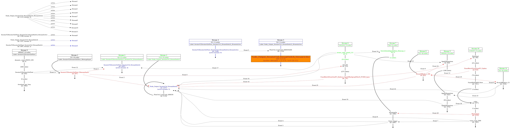
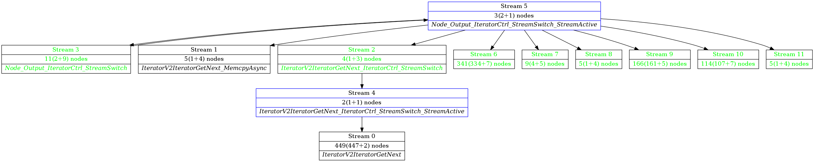

# 快照收集及异常图数据检测工具使用说明<a name="ZH-CN_TOPIC_0000001229235883"></a>

## 适用场景<a name="section67851121276"></a>

**任务在Device执行卡住，没有返回也没有退出。** 在5.0.4.alpha003及之后版本，提供可触发式获取当前Device的执行快照，包含所有激活流当前执行的task信息。适用于：

1.  判断是执行过慢还是执行态卡住。
2.  获取当前Device执行卡住的执行任务信息。
3.  对于TF框架下图数据异常导致的执行态卡住，结合dump图数据提供检索工具，可快速查找异常图数据源头，加速问题定位。

## 约束和限制<a name="section1001040142719"></a>

1.  获取的执行快照信息中，映射图节点名数据依赖下发Runtime任务时传递tag数据，ACL场景用户自行下发任务时可能无法展示对应tag，但可以显示当前执行的task类型。
2.  TF框架下，存在v2控制算子时，查找异常图数据源头工具暂不支持。

## 环境准备<a name="section1697913152815"></a>

1. 使用快照收集能力，需安装5.0.4.alpha003之后的软件版本。

2. 使用异常图数据检索工具，需安装python软件与graphviz软件。

   1. 安装python软件，推荐使用python3版本。

      ubuntu系统下安装命令：apt-get install python3

   2. 安装graphviz软件。

      ubuntu系统下安装命令：apt-get install graphviz


## 工具获取途径<a name="section15460162872817"></a>

请登录gitee网站Ascend生态社区获取：

https://github.com/Ascend/tools/tree/master/exec

# 快照收集<a name="ZH-CN_TOPIC_0000001229236245"></a>

## 操作步骤<a name="section12963484342"></a>

1. 执行异常用例之前，配置环境变量：

   export NPU\_COLLECT\_PATH=/xx/xx

   /xx/xx为已存在、可访问的文件路径，用于存放结果文件。

2. 执行异常用例。

3. 执行到卡住状态、需要收集Device执行快照时，在上述环境变量配置的路径下，新建名为exec\_record\_trigger的文件，触发快照收集。

4. 训练任务会在环境变量配置的路径下，新增名为“exec\_record\_进程ID”的文件。收集设备上当前进程下发的所有Device上仍在执行的流信息，以及流上正在执行的task信息。每间隔1min收集一次，总共收集5次后，自动删除exec\_record\_trigger触发文件。

## 结果文件格式说明<a name="section632831003513"></a>

结果文件内容示例如下：

```
Device[0] total running stream num=0
@@@
Device[0] total running stream num=0
@@@
Device[0] total running stream num=0
@@@
Device[0] total running stream num=0
@@@
Device[0] total running stream num=2
        [0] streamId=18, taskId=2, taskType=1, Conv2D_1.
        [1] streamId=19, taskId=2, taskType=13, no task tag is set.
```

1.  @@@符号分割前后5次快照收集的数据，两行@@@符号之间是一次完整的快照数据。
2.  快照数据第一行内容报错当前的Device设备的ID序号，以及其上面还在工作的流总数目。
3.  快照数据接下来逐行显示每一条工作流的流ID，流上当前在执行的任务ID、任务类型，以及映射回图数据上的节点名。

> **说明：** 
>
>1.  节点名展示能力，依赖RTS上游组件下发任务时，传递tag数据。若未传递则展示为no task tag is set。
>2.  执行时存在一条业务无关的调度流，因此一般会有一条任务taskType=13的工作流，显示没有tag设置，此条数据没有tag是正常的。

## 结果文件解读<a name="section3239133573517"></a>

1. 每次的快照信息都为空：用例任务不在Device执行状态。

   ```
   Device[0] total running stream num=0
   @@@
   Device[0] total running stream num=0
   @@@
   Device[0] total running stream num=0
   @@@
   Device[0] total running stream num=0
   @@@
   Device[0] total running stream num=0
   @@@
   ```

2. 每次快照的内容不同：用例任务在Device执行状态，仍在工作，未卡住。

   ```
   Device[0] total running stream num=6
           [0] streamId=18, taskId=2, taskType=3, no task tag is set.
           [1] streamId=19, taskId=2, taskType=3, no task tag is set.
           [2] streamId=20, taskId=2, taskType=3, no task tag is set.
           [3] streamId=21, taskId=2, taskType=3, no task tag is set.
           [4] streamId=22, taskId=2, taskType=0, no task tag is set.
           [5] streamId=61, taskId=2408, taskType=13, no task tag is set.
   @@@
   Device[0] total running stream num=11
           [0] streamId=23, taskId=5, taskType=3, no task tag is set.
           [1] streamId=24, taskId=5, taskType=3, no task tag is set.
           [2] streamId=25, taskId=3, taskType=3, no task tag is set.
           [3] streamId=27, taskId=5, taskType=3, no task tag is set.
           [4] streamId=28, taskId=5, taskType=3, no task tag is set.
           [5] streamId=29, taskId=5, taskType=3, no task tag is set.
           [6] streamId=31, taskId=5, taskType=3, no task tag is set.
           [7] streamId=32, taskId=5, taskType=3, no task tag is set.
           [8] streamId=33, taskId=3, taskType=3, no task tag is set.
           [9] streamId=58, taskId=111, taskType=24, no task tag is set.
           [10] streamId=61, taskId=2612, taskType=13, no task tag is set.
   @@@
   Device[0] total running stream num=4
           [0] streamId=18, taskId=2, taskType=3, no task tag is set.
           [1] streamId=19, taskId=2, taskType=3, no task tag is set.
           [2] streamId=22, taskId=92, taskType=0, no task tag is set.
           [3] streamId=61, taskId=2818, taskType=13, no task tag is set.
   @@@
   Device[0] total running stream num=3
           [0] streamId=23, taskId=78, taskType=3, no task tag is set.
           [1] streamId=25, taskId=96, taskType=0, no task tag is set.
           [2] streamId=61, taskId=3022, taskType=13, no task tag is set.
   @@@
   Device[0] total running stream num=2
           [0] streamId=58, taskId=2, taskType=0, no task tag is set.
           [1] streamId=61, taskId=3228, taskType=13, no task tag is set.
   @@@
   ```

3. 每次快照内容相同，工作流都停留在taskType为3的任务：图数据异常导致执行卡死，若为tf场景，结合[异常图数据检测](异常图数据检测.md)辅助定位。

   ```
   Device[1] total running stream num=18
           [0] streamId=23, taskId=5, taskType=3, tag=ge_default_20211117150604_131_Recv_1
           [1] streamId=25, taskId=3, taskType=3, no task tag is=ge_default_20211117150604_131_Recv_10
           [2] streamId=26, taskId=5, taskType=3, no task tag is=ge_default_20211117150604_131_Recv_0
           [3] streamId=61, taskId=3228, taskType=13, no task tag is set.
   @@@
   ……
   ```

4. 每次快照内容相同，不是所有工作流都停留在taskType为3的任务：有单个任务执行卡死，从非taskType为3的工作流任务着手分析。

   ```
   Device[1] total running stream num=18
           [0] streamId=23, taskId=5, taskType=1, tag=Conv2D_1
           [1] streamId=25, taskId=3, taskType=3, no task tag is=ge_default_20211117150604_131_Recv_10
           [2] streamId=26, taskId=5, taskType=3, no task tag is=ge_default_20211117150604_131_Recv_0
           [3] streamId=61, taskId=3228, taskType=13, no task tag is set.
   @@@
   ……
   ```

# 异常图数据检测<a name="ZH-CN_TOPIC_0000001229394807"></a>

## 操作步骤<a name="section0410193512502"></a>

命令格式：

**python3 exec\_block\_analyze.py **_arg1 arg2_** --device\_id=**_id_

-   arg1: CANN框架执行训练或ATC转换时生成的dump图数据文件，pbtxt或txt格式均可，选择图名称为PreRunAfterBuild的主训练图。**必选**  。
-   arg2: 快照信息文件。**必选**  。
-   device\_id: 任务执行所在的Device对应ID，默认为0。**可选。**

命令示例：

**python3 exec\_block\_analyze.py **_ge\_proto\_00001602\_PreRunAfterBuild.txt exec\_record\_1123_** --device\_id=**_1_

## 输出结果说明<a name="section7211182218514"></a>

执行输出主要分为三部分：屏显日志打印、流间同步关系的图片文件、流间激活关系的图片文件，一般直接看输出的图片文件即可。

1. 屏显日志打印。

   如下表示recv节点，依赖的send节点所在的流ID没有被激活：

   ```
   Message: streamid:2 last_exec_node:ge_default_20211117150604_131_Recv_1, the streamid:1 it's send node:IteratorV2IteratorGetNext_MemcpyAsync at, is not active.should have been actived by node:Node_Output_IteratorCtrl_StreamSwitch_StreamActive
   ```

2. 流间同步关系的图片文件。

   根据传入的dump图数据文件名称，会生成对应的如下名称文件：

   -   ge\_proto\_00001602\_PreRunAfterBuild.sequence.dot
   -   ge\_proto\_00001602\_PreRunAfterBuild.sequence.png
   -   ge\_proto\_00001602\_PreRunAfterBuild.sequence.svg

   dot文件是文本文件，按照graphviz格式填写，可以不关注。

   png文件是图片文件，可用图片编辑器打开；如果图片内容过大时，png文件可能会无法生成，此时可以用浏览器打开svg文件来查看，svg文件内容和png文件完全一致。

   **图片内容说明：**

   1. 左上角的部分为流间激活关系的展示，左侧为源激活流，右侧为目标激活流，虚线为激活方向。

   2. 下面为主体部分，展示了各个流上的任务关系，以及流间的同步关系。

      - 每个文本框向下的一纵列代表一条流：

        黑色文本框代表默认激活流，蓝色文本框代表非默认激活流；

        黑色文字代表当前流在快照文件里不在执行，绿色文字代表当前在快照文件里正在执行；

        文本框向下的实线连接的节点，代表这条流上的每个执行任务，实线的连接顺序代表在当前流上执行顺序；

      - 每条流上的任务间连接的虚线代表同步关系，含义是虚线源头的节点执行完之后虚线末端的节点才能被执行。

      - 图上执行任务绿色代表当前任务根据快照信息显示已经执行完成。

      - 图上执行任务为红色，以及红色的虚线，代表着这些节点上的event没有发出去，导致后续的流上卡住，并且这些红色的节点都是被连带影响的。

      - 黄色底纹、字体加大加粗的执行任务，是根据同步以及激活关系，自动找到的源异常任务，可以直接基于此展开问题的分析。

        如[图1](#fig978115287290)示例，黄色底纹的激活任务未执行，导致后续流上的同步消息发不出去，最终影响到一批流卡在同步等待点。

      **图 1**  流间同步关系的图示例<a name="fig978115287290"></a>  
      

3. 流间激活关系的图片文件。

   根据传入的dump图数据文件名称，生成对应的如下名称文件：

   -   ge\_proto\_00001602\_PreRunAfterBuild.streams.dot
   -   ge\_proto\_00001602\_PreRunAfterBuild. streams.png
   -   ge\_proto\_00001602\_PreRunAfterBuild. streams.svg

   **图片内容说明：**

   - 每一个文本框代表一条流。

   - 文本框之间的实线代表激活关系，箭头为激活方向。

   - 黑色文本框代表默认激活流，蓝色文本框代表非默认激活流。

     黑色文字代表当前流在快照文件里不在执行，绿色文字代表当前流在快照文件里正在执行。

     **图 2**  流间激活关系的图示例<a name="fig1763173303013"></a>  
     


