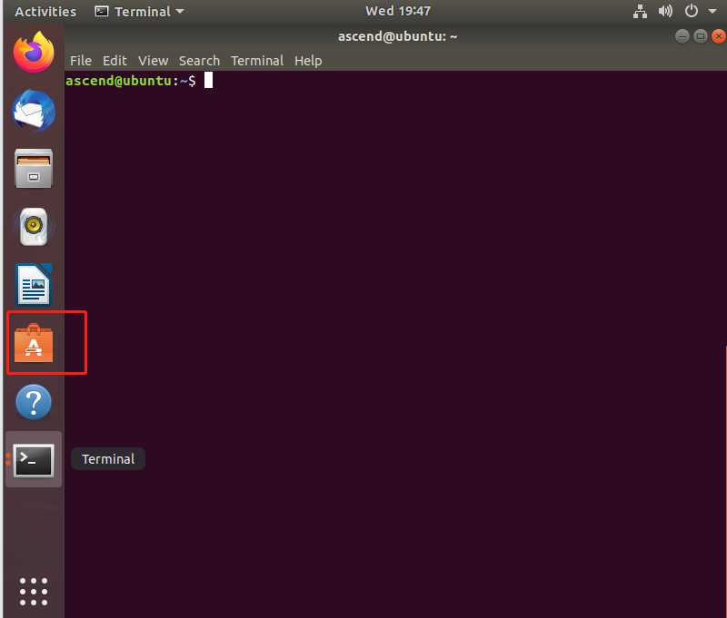
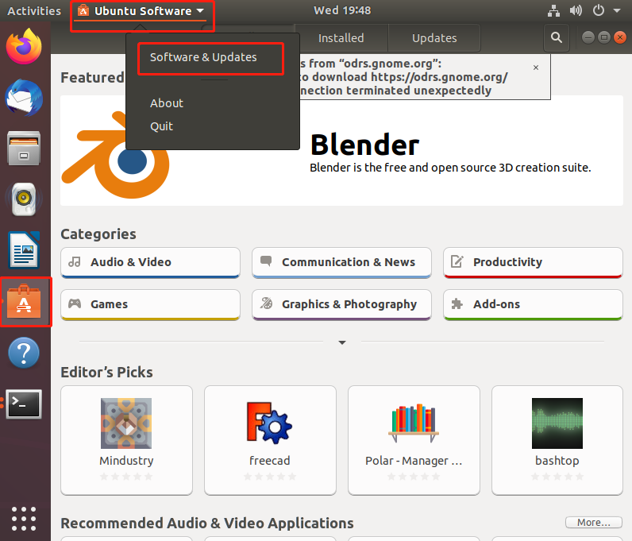
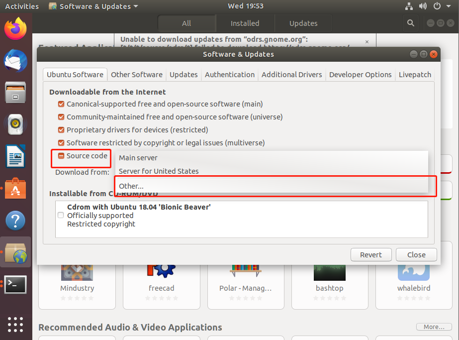
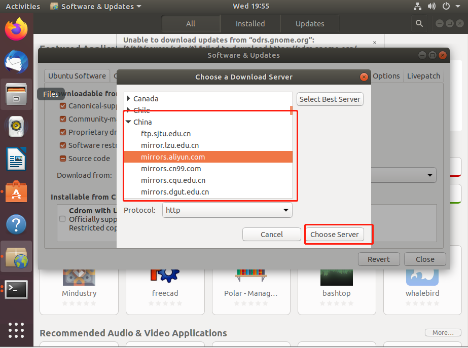
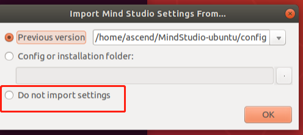
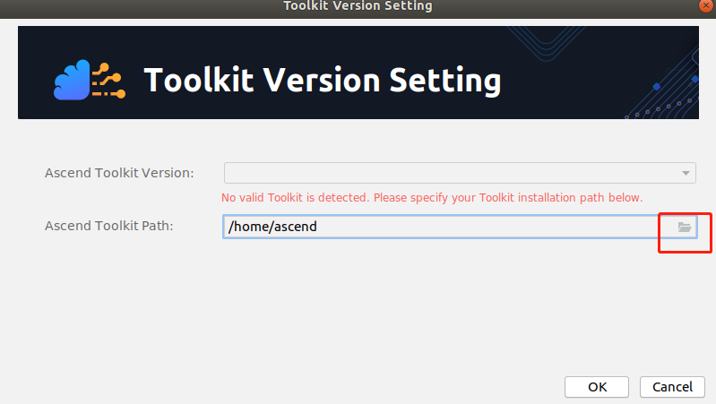
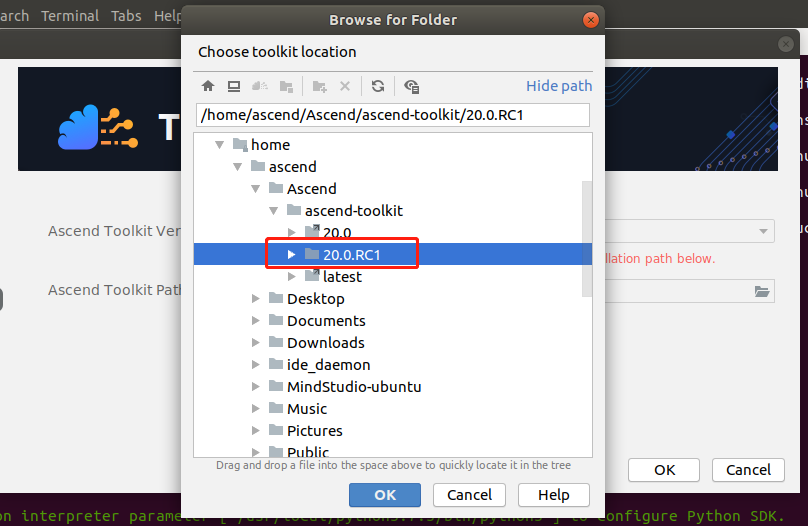

EN|[中文](README.md)

# Ascend Development Environment, for Atlas 200 DK, Atlas 300
# version: 20.0.0.RC (1.73)

#### Introduction

This script is applicable to the Ubuntu 18.04 OS and can be used to quickly install development environment, including the Python environment and MindStudio.
#### Preparations
1. Ubuntu 18.04 (x86).

2. Download the Toolkit packages (**Ascend-Toolkit-[version]-x86_64-linux_gcc7.3.0.run** and **Ascend-Toolkit-[version]-arm-linux_gcc7.3.0.run**) from https://www.huaweicloud.com/ascend/resource/Software for MindStudio installation. Save the downloaded packages to the **$HOME** directory.

Some samples require the **Ascend310-driver-1.73.5.1.b050-ubuntu18.04.aarch64-minirc.tar.gz** package. The package can be downloaded from the preceding website. You can download and decompress it as required.

3. Configure the download source. (The following provides a method for the configuration.)

(1) Click the icon in Step 1.

(2) Click the icon in the red box in Step 2.

(3) Select the fifth option in Step 3 and select **Other**.

(4) Select the source as needed, as shown in the following figure. 

#### Instructions

1. Download the **faster_install.sh** script. Run the following command on the Ubuntu server to go to the **$HOME** directory:

**cd $HOME**

Download the **faster_install.sh** script.

**git clone https://gitee.com/ascend/tools.git**

Copy the **faster_install.sh** script from the **faster-install** directory to the **$HOME** directory.

**cp ~/tools/faster_install/for_1.7x.0.0/faster_install.sh  .**

Run the script.

**bash faster_install.sh**

2. After the installation is complete, the following page is displayed. Select the option (the third line) in the red box in the following figure and click **OK**.

3. Select the option in the red box.

4. Select the option as shown in the following figure, and click **OK**.

5. MindStudio is automatically closed. In this case, restart MindStudio. The C7x development environment is now installed.