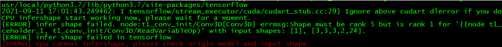
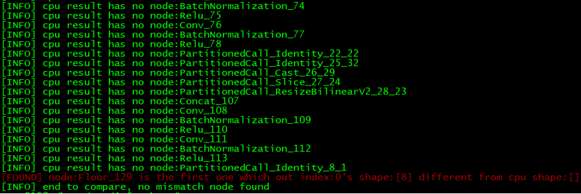
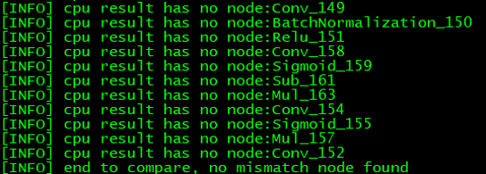
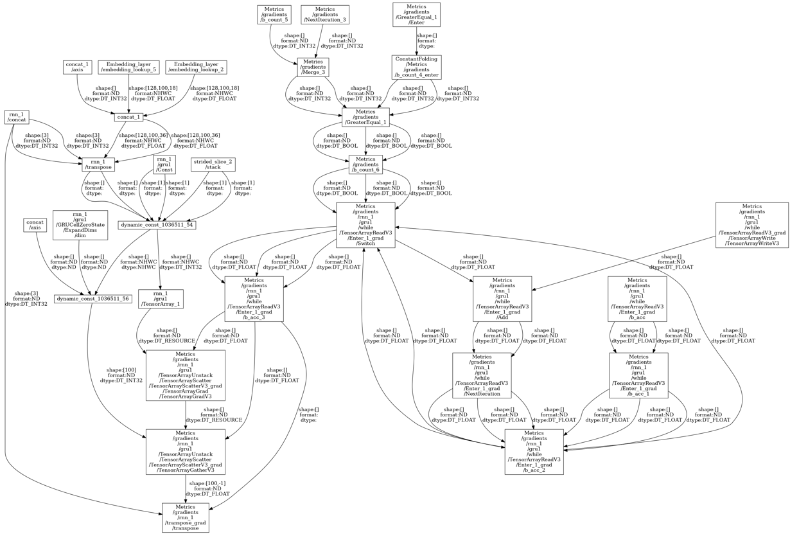

# 工具介绍

## 适用场景

infershape故障诊断工具适用于对CANN框架的**编译态**infershape推导结果存在疑义的问题，包括不限于如下场景：

1.  算子infershape推导过程中报错，指向输入tersor规格不符合预期。
2.  算子编译报错，指向输入数据中的shape或dtype信息不符合预期。

对于非约束场景，可使用本工具自动将CANN框架infershape结果与原框架infershape结果做比对，找到结果不一致的首层算子，辅助分析。

对于CANN dump图过大，无法打开的场景，可使用本工具指定末节点回溯N层对局部图做可视化展示，辅助人工分析。

## 约束和限制

使用infershape故障诊断工具具有以下约束/限制：

1.  **执行态**infershape场景的问题，当前工具**不适用。**
2.  shape range参数的校验异常，当前工具无法判定。
3.  **CANN推导能力比原框架强的场景**，当前工具无法自动锁定异常（如原框架推导unknown rank，CANN框架推导为静态shape，则无法判定是否正确）。
4.  CANN**常量折叠掉的分支内部**推导异常，当前工具无法做复原与区分。
5.  原框架为onnx的场景，利用onnx重新推导的结果与CANN图存在不少的算子缺失，此部分无法比对。
6.  原框架为tf的场景，在tf1.15下推导可能存在异常，建议直接在tf2.x版本下使用此工具。

## 环境准备

使用infershape故障诊断工具前，请确保环境已安装以下模块：

1.  已安装g++软件，需要**g++5.2**版本以上。
2.  已安装python软件，推荐使用python3版本。

    ubuntu系统下可使用apt-get install python3 命令安装。

3.  已安装tensorflow软件，推荐2.x版本。使用如下命令可查看是否安装tf以及版本信息。

    python3 -c 'import tensorflow as tf; print\(" ".join\(tf.\_\_version\_\_\)\)'

4.  已安装onnx的python库。

    已安装好python的前提下，可使用pip3 install onnx命令安装。

5.  已安装graphviz软件，使用局部图可视化脚本时依赖，自动比对脚本不依赖。

    ubuntu系统下可以使用 apt-get install graphviz 命令安装。

## 工具获取途径

infershape故障诊断工具获取路径：

https://github.com/Ascend/tools/tree/master/infershape

此路径下包含了多个脚本，各自功能如下：

-   check\_infershape\_main.sh：主入口脚本，完成获取原框架结果、CANN框架结果，及结果比对。
-   pb\_infershape.cpp：加载pb文件或TF\_GeOp文件，在tensorflow原框架下得出infershape推导结果，结果会写在 cpu\_infershape\_result文件中。
-   pb\_infer\_run.sh：编译pb\_infershape.cpp文件，并执行。
-   onnx\_model\_infershape.py：加载onnx文件，在onnx原框架下得出infershape推导结果的源码，结果会写在 cpu\_infershape\_result文件中。
-   analyze\_onnx\_graph.py：加载CANN dump图文件，解析并输出infershape推导结果，结果写在npu\_infershape\_result文件中。
-   compare.sh：对npu\_infershape\_result文件与cpu\_infershape\_result文件结果进行比对的脚本，找到首个两者结果不一致的节点。
-   show\_part\_node.py：指定末节点，回溯N层，局部图可视化展示脚本。

# 工具使用
## 与原框架结果比对，自动扫描首层结果不一致的算子

### 命令行使用说明

**命令行格式：**  ./check\_infershape\_main.sh arg1 arg2 arg3 arg4

**arg参数说明：**

-   arg1:  CANN框架执行训练或atc模型转换时生成的dump图数据，请选择名称里带“after\_infershape”关键字的pbtxt格式dump图传入。**必选**。

    > **说明：** 
    >-   infershape推导失败的话，直接取最后一张生成的pbtxt图即可。
    >-   设置环境变量export DUMP\_GE\_GRAPH=2后执行训练或atc模型转换任务，会在执行文件夹下生成dump图数据。

-   arg2:  tf训练场景，请传入dump图数据, tf1.x是TF\_GeOp开头的, tf2.x是npu\_cluster\_开头；tf/onnx atc模型转换场景，请传入原始的pb/onnx格式的模型文件。**必选。**

    > **说明：** 
    >设置环境变量export PRINT\_MODEL=1后执行训练，会在执行文件夹下生成TF\_GeOp或者npu\_cluster\_开头的图数据，取最后一张即可。

-   arg3:  用于指定输入算子的shape规格， atc模型转换场景使用，格式同atc命令中的input\_shape选项，详细介绍请参考《ATC工具使用指南》。 **可选。**
-   arg4:  结束比对的算子名称，对于infershape阶段直接报错的场景，可用此选项设置比对结束点，以免扫描到后续还未进行infershape的算子，造成干扰。**可选。**

**命令行执行示例：**

1.  atc模型转换场景，不指定输入shape，不指定结束比对节点，pb模型。

    **./check\_infershape\_main.sh ge\_onnx\_00000012\_graph\_0\_after\_infershape.pbtxt  ../tf\_model.pb**

2.  atc模型转换场景，指定输入shape，不指定结束比对节点，onnx模型。

    **./check\_infershape\_main.sh /home/test/ge\_onnx\_00000012\_graph\_0\_after\_infershape.pbtxt  ../onnx\_model.onnx "input\_1:8,3,512,512;input\_2:1,224,224,8"**

3.  训练场景，指定结束比对节点。

    **./check\_infershape\_main.sh ge\_onnx\_00000012\_graph\_0\_after\_infershape.pbtxt  TF\_GeOp5\_0.pbtxt "" stop\_node\_name**

### 屏显结果分析

脚本执行过程中，会有不同的日志输出，主要输出的日志行内容含义如下：

1.  \[FOUND\] cpu cannot infershape, please check origin model and input shape.

    此日志主要出现在atc模型转换场景，代表传入的输入算子shape规格有误，和原模型不匹配，在原框架下也无法展开推导。此日志打印后会直接中断流程。出现此打印：需要从输入排查input\_shape参数与模型是否匹配。

    

2.  \[FOUND\] xxx\_node\_name is the first one which out 0's shape:\[xxxx\] different from cpu shape:\[xxxx\]

    此日志表示已经找到首个CANN infershape推导结果与原框架不一致的节点，节点名称、输出序号，两边的shape值都在内容中展示。此日志打印后会直接中断流程。出现此打印：需要扫描出的目标节点给出与原框架结果不一致的理由，大概率是此节点直接引入的问题。

    

3.  \[WARNING\] $node cpu infer result is unknown rank, can't judge

    此日志表示原框架的infershape推导结果为unknown rank，而CANN框架推导结果不是，属于CANN推导能力比原框架强的场景，无法判断，会跳过继续后续算子的对比，打印此日志做记录。

4.  \[WARNING\] $node dtype is DT\_RESOURCE and out $npu\_index's $npu\_shape different from cpu $cpu\_shape, can't judge

    此日志表示算子的推导结果dtype类型为 DT\_RESOURCE，这种类型在框架内会做特殊处理，推导结果始终表示为标量，因此与原框架不一致时无法判定为异常，会跳过继续后续算子的对比，打印此日志做记录。

5.  \[INFO\] cpu result has no xxx\_node\_name

    此日志表示CANN框架下找到了原框架里没有的节点，会跳过继续后续算子的对比，打印此日志做记录。目前多出现在常量折叠后的节点以及ONNX场景（原框架推导会有节点优化，导致节点丢失）。

6.  \[INFO\] reach last xxx\_node\_name, end to compare, no mismatch node found

    \[INFO\] end to compare, no mismatch node found

    此日志表示完成了所有节点的比对，没有找到与原框架直接的结果不一致的节点。出现此打印有两种可能性：

    1）NPU推导与原框架完全一致，infershape推导过程没有问题。

    2）由于约束和限制，无法直接比对的部分引入了异常，若出现此打印时伴随着上述3、4的warning日志，可从warning日志对应节点入手判断是否有异常。结合下一节的局部图展示工具，在报错节点输入路径上的，且有warning日志表示无法比对的，是最大的嫌疑点。

    

### 结果文件格式说明

执行脚本完成，若已开展比对，会有如下的文件输出：

-   cpu\_infershape\_result文件：存储原框架infershape推导的结果。
-   npu\_infershape\_result文件：存储CANN框架infershape推导的结果。

文件中每一行包括了节点名称、节点输出tensor序号、tensor里的shape信息、tensor里的dtype信息，示例如下：

node:conv\_7 index:0 shape:\[8,64,256,256\] dtype:DT\_FLOAT

## 指定末节点，回溯N层，局部图tensor规格可视化展示

### 命令行使用说明

**命令行格式：**python3 show\_part\_node.py arg1 arg2 arg3

**arg参数说明：**

-   arg1：CANN框架执行训练或atc模型转换时生成的dump图数据，pbtxt格式。**必选。**
-   arg2：指定的末节点名称。**必选。**
-   arg3：回溯层数。**必选。**

**命令行执行示例：**

python3 show\_part\_node.py ge\_onnx\_00000012\_graph\_0\_after\_infershape.pbtxt 6

### 展示结果分析

执行脚本完成后，输出类似下图的可视化结果：

1.  最下面的节点，为指定的目标节点。
2.  指定层数的输入节点向上逐层展示，若某输入节点有多输出，非指向目标节点的输出部分不会展示。
3.  每条箭头都代表了一个节点间传递的tensor，tensor的shape、format、dtype信息都在箭头上展示。

借助可视化图从目标节点开始，逐层向上寻找可疑节点。基本规则可以按照输入节点在[与原框架结果比对，自动扫描首层结果不一致的算子](与原框架结果比对-自动扫描首层结果不一致的算子.md)结果中有warning输出，则有嫌疑，逐层向上找到第一个有warning日志的节点开始分析其正确性。

