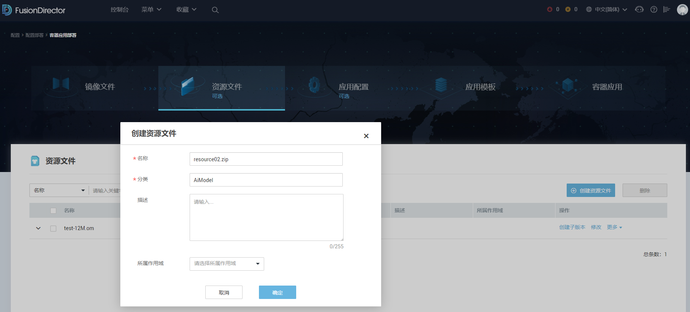
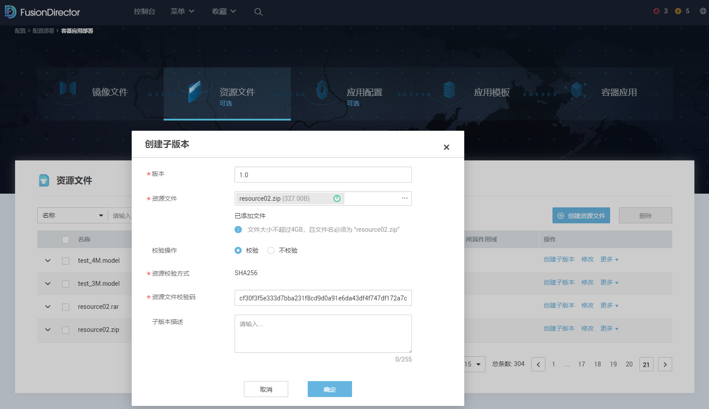

# container_capability_tool工具
## 背景
原生Kubeedge支持特权容器、主机网络、root运行、主机挂载卷等容器高危险能力，AtlasEdge在商用软件
中对这些容器危险能力进行了限制，通过配置文件对这些能力进行了限制，通过修改配置文件可支持，可实现开源
原生Kubeedge容器部署能力，但开放这些能力存在安全风险(如容器逃逸)，请慎用并确保使用场景安全可信。

**免责声明**：若客户开放了Kubeedge这些高危险能力造成安全问题，与AtlasEdge商用软件无关。

## 约束
- 该工具需配套MindX Edge使用，支持配套MindX Edge 2.0.4.6及以后的版本

## 前置条件
1. MindX Edge已安装运行。

## 目录文件说明

1. modify_pod_config_cmd_executor.py: 提供执行shell命令的能力
2. modify_pod_config_item.py: 提供对容器开关参数的校验,修改方法
3. modify_pod_config_json.py: 修改容器危险能力开关程序入口
4. modify_pod_config_logger.py：记录脚本日志
5. picture: README中使用的图片
6. README.md: 帮助指导


## 工具使用方法
1 执行如下命令修改脚本文件权限，请根据实际安装目录适配
```
chattr -i AtlasEdge软件安装路径/edge_work_dir/edge_core/src/*
```
2 获取工具脚本下的所有.py文件，并存放于"AtlasEdge软件安装路径/edge_work_dir/edge_core/src/"目录下

3 参考如下命令，根据需要选择参数配置，请注意addHostPath和deleteHostPath参数不能在同一次执行命令中输入。
```
python3 AtlasEdge软件安装路径/edge_work_dir/edge_core/src/modify_pod_config_json.py \
--useSecuritySetting=true \
--checkImageSha256=true \
--useCapability=false \
--usePrivileged=false \
--usePrivilegeEscalation=false \
--useRunAsRoot=false \
--useProbe=false \
--useStartCommand=false \
--useHostNetwork=false \
--useSeccomp=false \
--useDefaultContainerCap=false \
--setRootFsReadOnly=true \
--emptyDirVolume=false \
--containerCpuLimit=2.0 \
--containerNpuLimit=1.0 \
--containerMemoryLimit=2048 \
--maxContainerNumber=16 \
--totalModelFileNumber=512 \
--containerModelFileNumber=48 \
--systemReservedCPUQuota=1.0 \
--systemReservedMemoryQuota=1024 \
--imageSha256WhiteList=sha256:1f082f05a7fc20f99a4ccffc0484f45e6227984940f2c57d8617187b44fd5c46,sha256:b0b140824a486ccc0f7968f3c6ceb6982b4b77e82ef8b4faaf2806049fc266df \
--addHostPath=/var/lib/docker/modelfile/ \
--deleteHostPath=/var/lib/docker/modelfile
```
回显示例如下，即表示命令执行成功：

`modify pod config success`

4 重启中间件使配置生效，执行如下命令：
```
AtlasEdge软件安装路径/run.sh restart
```

**参数说明如下：**

                                                表1

| 参数                        | 取值类型   | 说明                                                                                                                                                         |
|:--------------------------|:-------|:-----------------------------------------------------------------------------------------------------------------------------------------------------------|
| useSecuritySetting        | bool   | 校验总开关，true表示进行容器安全校验,false不进行容器安全校验                                                                                                                        |
| checkImageSha256          | bool   | true表示进行容器镜像sha256校验,false表示不进行校验                                                                                                                          |
| useCapability             | bool   | true表示允许容器配置能力项,false表示不支持容器配置能力项                                                                                                                          |
| usePrivileged             | bool   | true表示允许容器以特权模式运行,false表示不支持容器以特权模式运行                                                                                                                      |
| usePrivilegeEscalation    | bool   | true表示允许容器使用特权提升,false表示不运行容器使用特权提升                                                                                                                        |
| useRunAsRoot              | bool   | true表示允许容器以root用户运行,false表示不允许容器以root用户运行,普通用户的容器可运行                                                                                                       |
| useProbe                  | bool   | true表示允许容器使用探针,false表示不允许容器使用探针                                                                                                                            |
| useStartCommand           | bool   | true表示允许容器使用启动命令,false表示不允许容器使用启动命令                                                                                                                        |
| useHostNetwork            | bool   | true表示允许容器使用主机网络,false表示不允许容器使用主机网络                                                                                                                        |
| useSeccomp                | bool   | true表示是否使用docker默认的Seccomp配置,true表示不使用docker默认的Seccomp配置                                                                                                   |
| useDefaultContainerCap    | bool   | true表示可以使用Docker默认的14项能力,false表示不可使用Docker默认的14项能力                                                                                                         |
| setRootFsReadOnly         | bool   | true表示设置容器的根文件系统挂载为只读模式,false表示设置文件的根文件系统挂载为读写模式,建议设置为true                                                                                                 |
| emptyDirVolume            | bool   | true表示支持配置emptyDir挂载卷的容器,false表示不支持配置emptyDir挂载卷的容器,建议设置为false                                                                                             |
| imageSha256WhiteList      | dict   | 以字符串形式导入容器镜像sha256白名单,字符串内使用英文逗号分割容器镜像sha256值,每个容器镜像sha256值需要以sha256:为前缀,容器镜像sha256为容器引擎为镜像生成的64个字节的哈希值。单次最多导入8个容器镜像sha26白名单,总数不超过128个                     |
| containerCpuLimit         | float  | 表示单个容器需要使用的CPU资源上限,取值为单位时间内占用CPU核心的时间片份额,取值范围为[0.01,100.0]                                                                                                 |
| containerNpuLimit         | float  | 表示单个容器需要使用的NPU资源上限,取值范围为[0,100.0]                                                                                                                          |
| containerMemoryLimit      | int    | 表示单个容器需要使用的内存资源上限,单位为MB,取值范围为[4,65536]                                                                                                                     |
| addHostPath               | string | 以字符串形式导入主机挂载目录或文件白名单,多个主机挂载目录或文件须用英文逗号分隔,输入的每个目录或文件须以"/"开头以确保为绝对路径或处于绝对路径下，目录结尾需要带"/",文件结尾不带"/"。该命令无法与deleteHostPath命令同时执行。单个hostPath字符串长度不超过1024,最多添加256个 |
| deleteHostPath            | string | 以字符串形式删除主机挂载目录或文件白名单,多个主机挂载目录或文件须用英文逗号分隔,输入的每个目录或文件应在白名单内,否则报错,同时应以"/"开头以确保为绝对路径或处于绝对路径下,目录结尾需要带"/",文件结尾不带"/"。该命令无法与addHostPath命令同时执行                      |
| maxContainerNumber        | int    | 表示设备上允许配置的最大容器个数,最多不超过128个。可配置的configmap个数为最大允许容器个数的4倍                                                                                                     |
| totalModelFileNumber      | int    | 表示模型文件总量:默认配置为512,最大配置不超过2048                                                                                                                              |
| containerModelFileNumber  | int    | 单个容器的模型文件数量:默认配置为48,最大不超过模型文件总量的配置                                                                                                                         |
| systemReservedCPUQuota    | float  | 系统预留CPU资源,默认为系统预留1个CPU核心,其余CPU资源用于应用部署。取值范围[0.5,4.0]                                                                                                       |
| systemReservedMemoryQuota | int    | 系统预留内存资源,默认为系统预留1024MB,其余内存资源用于应用部署。取值范围[512,4096]                                                                                                         |

提示：
关闭useSecuritySetting校验或者打开capability、privileged、allowPrivilegeEscalation、runAsRoot、probe、startCommand、useHostNetwork、useDefaultContainerCap等选项或关闭setRootFsReadOnly、checkImageSha256等选项,可能会有容器逃逸或系统资源受损的风险。

----结束

## FD上应用部署操作补充介绍
### 资源文件创建及应用
1.  在FusionDirector界面上方菜单栏选择“菜单 > 配置 > 配置部署 > 容器应用部署 > 资源文件”，进入资源文件管理界面。

2. 单击“创建资源文件”，进入资源文件创建界面


3. 配置资源文件信息，完成配置后单击“确定”。


| 参数    | 说明                                                                                                    | 取值                                                                                  |
|:------|:------------------------------------------------------------------------------------------------------|:------------------------------------------------------------------------------------|
| 名称    | 资源文件名称。                                                                                               | 长度为1-255个字符，只能包含大小写字母、数字、中划线（-）、下划线（_）、英文点（.），开头必须使用大小写字母或数字且只能以.om、.tar.gz或.zip结尾。 |
| 分类    | 用户自定义的资源文件分类，例如AiModel、media等。                                                                        | 长度为1-64个字符，只能包含大小写字母、数字、中划线（-）、下划线（_）、英文点（.）。                                       |
| 描述    | 资源文件的描述。                                                                                              | -                                                                                   |
| 所属作用域 | 选择所属作用域，可选参数，只有创建了作用域，才能进行选择，关于作用域的说明请参见《FusionDirector 操作指南》中的“配置与管理FusionDirector > 用户 > 作用域管理”章节。。 | -                                                                                   |

4.  在资源文件列表中选择该资源文件，单击其后的“创建子版本”，进入创建子版本页面。
5.  配置子版本信息，完成配置后单击“确定”。


| 参数      | 说明                             | 取值                                                                                                          |
|:--------|:-------------------------------|:------------------------------------------------------------------------------------------------------------|
| 版本      | 子版本的版本号。                       | 长度为1-64个字符，只能包含大小写字母、数字、中划线（-）、下划线（_）、英文点（.）。                                                               |
| 选择文件    | 用户上传资源文件。                      | 上传.om、.zip、.tar.gz类型的文件，文件大小不超过4GB，且文件名必须与资源文件名称相同，例如资源文件名称为resource02.zip，则选择的文件名称也是resource02.zip。        |
| 校验操作    | 是否对上传的资源文件进行校验。                | 是否对上传的资源文件进行校验。                                                                                             |
| 资源校验方式  | 当对上传的资源文件进行校验操作时，需配置资源文件的校验方式。 | 当前仅支持SHA256。                                                                                                |
| 资源文件校验码 | 当对上传的资源文件进行校验操作时，需输入资源文件的校验码。  | 校验码有多种获取方法，例如可以通过Windows系统自带命令certutil -hashfile “资源文件的绝对路径”sha256获取，即在Windows系统中输入cmd，进入命令提示符界面，输入该命令即可获取。 |
| 子版本描述   | 子版本的描述信息。                      | -                                                                                                           |

### 容器启动命令设置
设置控制容器运行的命令和参数，请用户根据容器实际情况进行配置。如果不设置运行命令和参数，容器运行时会运行镜像制作时提供的默认命令和参数，默认命令和参数具体请参见《FusionDirector 操作指南》中的“配置部署 > 容器应用部署 > 应用模板 > 创建应用模板”章节。
* 运行命令：输入控制容器运行的命令，支持二进制方式和Bash方式。
* 运行参数：输入控制容器运行的命令参数，多个参数以换行分隔。

配置示例如下：

| 运行命令       | 运行参数                                                                                           |
|:-----------|:-----------------------------------------------------------------------------------------------|
| /bin/bash  | -c /usr/local/Ascend/driver/tools/minirc_container_prepare.sh;/bin/bash;/usr/local/bin/run.sh  |

### 挂载卷配置
卷是指容器运行过程中使用的存储卷，将本地卷挂载到容器中，实现数据文件能够持久存储。如果不同容器本地卷名称相同，则卷类型必须相同。

单击“添加卷”，配置卷信息。

| 参数    | 说明                                                                                                                                                                                                                                                                                                                                                                                                                                                                                                                                                                                                                                                                                                                                                                                                                                                                                   |
|:------|:-------------------------------------------------------------------------------------------------------------------------------------------------------------------------------------------------------------------------------------------------------------------------------------------------------------------------------------------------------------------------------------------------------------------------------------------------------------------------------------------------------------------------------------------------------------------------------------------------------------------------------------------------------------------------------------------------------------------------------------------------------------------------------------------------------------------------------------------------------------------------------------|
| 本地卷名称 | 卷名称，长度为1-63个字符，只能包含小写字母和数字。                                                                                                                                                                                                                                                                                                                                                                                                                                                                                                                                                                                                                                                                                                                                                                                                                                                          |
| 类型    | 支持以下几种类型：<br/>**hostPath**：将主机某个目录挂载到容器中，是一种持久化存储，需要输入主机路径。主机路径只能选择白名单中的目录、或其子目录或者文件。若要新增白名单，可以在“AtlasEdge安装路径/edge_work_dir/edge_core/config/podconfig.json”中进行修改。修改时需要注意：目录结尾需要带"/"，文件结尾不能带"/"。出于安全考虑，建议只添加必要的目录和文件。具体配置请参考container_capability_tool工具使用说明。<br/>**emptyDir**：一种简单的空目录，主要用于临时存储，支持在硬盘或内存中创建。<br/>**configMap**：配置项，请确保已存在相应的配置项。<br/>**ResourceFile**：资源文件，请确保已存在相应的资源文件。<br/>**须知**：<br/> 1）如果资源文件需要独立于容器之外，单独挂载在主机上， 则仅支持HwHiAiUser用户的资源文件，容器必须为HwHiAiUser用户的容器，且HwHiAiUser的ID与设备上的HwHiAiUser用户的ID一致。<br/> 2） 如果选择了资源文件，需要在容器安全配置的主机挂载目录或文件白名单中添加“/var/lib/docker/modelfile/”，否则会导致容器部署失败，添加方法参加当前文档中工具使用方法章节介绍。<br/> 3）参考工具[edge_ability_tool](https://github.com/Ascend/tools/tree/master/intelligent_edge_tools/edge_ability_tool)使用说明打开"create_container"、"download_model_file"能力项，并重启中间件， <br/> 4）AtlasEdge没有提供容器的磁盘使用限额机制，需要用户自行确保磁盘的使用量，避免耗尽主机的磁盘空间，导致系统异常。 |
| 挂载目录  | 卷的挂载目录，以/开头，长度为2~1024个字符，只能包含数字、字母、斜杠（/）、中划线（-）、下划线（_）和英文点（.）                                                                                                                                                                                                                                                                                                                                                                                                                                                                                                                                                                                                                                                                                                                                                                                                                        |
| 权限    | 操作权限，在下拉列表中选择。                                                                                                                                                                                                                                                                                                                                                                                                                                                                                                                                                                                                                                                                                                                                                                                                                                                                       |

### 健康检查
探针介绍

| 项目      | 是否支持  | 作用                          | 检查方式                                   |
|:--------|:------|:----------------------------|:---------------------------------------|
| 容器存活探针  | 支持    | 周期性的检查容器是否正常运行，容器如果异常就会被重启  | 1 不配置 <br/>2. HTTP请求检查 <br/>3. 执行命令检查  |
| 业务就绪探针  | 支持    | 周期性检查服务是否ready              | 1. 不配置 <br/>2. HTTP请求检查 <br/>3. 执行命令检查 |

参数说明：

| 参数       | 说明                                                                   |
|----------|----------------------------------------------------------------------|
| http请求路径 | 访问请求路径，仅支持^/[a-z0-9A-Z_./-]+$， 且不超过1024                              |
| http请求端口 | 1-65535                                                              |
| 执行命令路径   | 仅支持输入脚本路径，如“/home/scripts/probe.py， 仅支持^/[a-z0-9A-Z_./-]+$， 且不超过1024 |
| 延迟参数/秒   | 1~3600                                                               |
| 超时时间/秒   | 1~3600                                                               |
| 探测周期/秒   | 1~3600                                                               |


### 主机网络
**须知**：
* 使用主机网络时，容器与主机间不做网络隔离，容器内应用程序可以访问宿主机上任意网络接口，建议使用安全性更高的端口映射模式。
* 如果容器的重启策略配置为“不重启”，当该容器出现异常时，该容器会一直保持异常状态。

### 端口映射
**须知**：
* 如果映射的容器端口取值为[0-1023], 需开启useDefaultContainerCap、useRunAsRoot能力并且容器以root用户运行，请参考本文中的"工具使用方法"章节配置需开启useDefaultContainerCap、useRunAsRoot能力项。

### 容器日志收集
FusionDirector容器日志收集约束：
* 只支持HwHiAiUser用户运行的容器，并且日志名后缀必须为.log，如果是其他用户运行的容器，日志会持续增长导致磁盘空间满
* 需将/var/log/container/添加到挂在卷白名单，具体操作参考本文档工具使用方法章节介绍，并且将容器日志挂在到/var/log/container/"容器名"目录下
* 容器日志收集功能在FusionDirector 1.7.2及之后版本支持此功能
* 容器内部记录日志时，不能一直占用文件句柄，否则导致日志转储后，文件无法清空


## 容器部署常见错误及解决方法
[请参考昇腾社区案例指导](https://bbs.huaweicloud.com/forum/thread-0221983618504460029-1-1.html)
