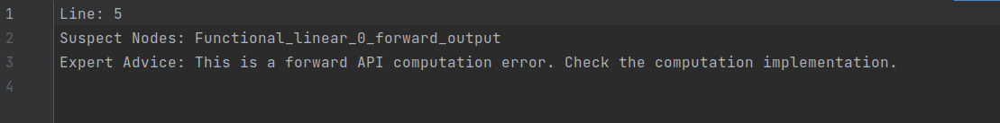

# **PyTorch精度工具使用指南**

## 简介
本文介绍ptdbg_ascend精度工具，用来进行整网API粒度的数据dump，精度比对和溢出检测，从而定位pytoch训练场景下的精度问题。

## 工具安装

### 环境和依赖

#### 环境
- 可执行pytorch训练任务的训练环境(安装了Pytorch 1.8 或者 Pytorch 1.11版本)

#### 工具依赖
- 通过pip安装环境依赖wheel、pyyaml、numpy、pandas（版本1.3.5及以上）

### 工具安装方式

ptdbg_ascend精度工具的安装方式包括：下载whl包安装和源代码编译安装。本文主要介绍whl包安装，源码编译安装详见：[ptdbg_ascend](https://github.com/Ascend/tools/tree/master/ptdbg_ascend)。


#### 下载whl包安装

1. 下载ptdbg_ascend精度工具的whl包。

   - [ptdbg_ascend-2.2-py3-none-any.whl](https://ptdbg.obs.myhuaweicloud.com/package/ptdbg_ascend/2.0/ptdbg_ascend-2.2-py3-none-any.whl)

2. 执行如下命令，进行安装。

   ```bash
   pip3 install ./ptdbg_ascend-{version}-py3-none-any.whl
   ```

   {version}表示软件版本号。

   说明：若为覆盖安装，请增加“--force-reinstall”参数强制安装，例如：

   ```bash
   pip3 install ./ptdbg_ascend-{version}-py3-none-any.whl --force-reinstall
   ```

   分别提示如下信息则表示安装成功：

   ```bash
   # ptdbg_ascend精度工具
   Successfully installed ptdbg_ascend-{version}
   ```

## 功能介绍   

### 接口说明

工具提供如下接口函数用于dump过程的配置，描述如下：

| 函数                | 描述                                                                                                |
| ------------------- |---------------------------------------------------------------------------------------------------|
| set_dump_path       | 用于设置dump文件的路径(包含文件名)，参数示例：“/var/log/dump/npu_dump.pkl”                                            |
| set_dump_switch     | 设置dump范围，不设置则默认处于关闭状态。第一个参数为：“ON” 或者 "OFF",若需要控制dump的算子范围，则需要第二、三个参数，默认不配置                        |
| seed_all            | 固定随机数，参数为随机数种子和确定性计算模式，默认种子为：1234，默认确定性计算模式为False.                                                                        |
 | set_backward_input | 设置反向ACL级别dump时需要的反向输入的路径,参数示例："acl_dump_xxx/Functional_conv2d_1_backward_input.0.npy"             
| register_hook       | 用于注册dump回调函数，例如：注册精度比对hook：register_hook(model, acc_cmp_dump).                                    |
| compare             | 比对接口，将GPU/CPU/NPU的dump文件进行比对，第三个参数为存放比对结果的目录；<br/>文件名称基于时间戳自动生成，格式为：compare_result_timestamp.csv. |
| parse               | (若pkl文件中有)打印特定api接口的堆栈信息、统计数据信息，第一个参数为pkl文件名，第二个参数为要抽取的api接口前缀，例如"Torch_norm_1_forward".          |
| compare_distributed | 单机多卡场景下的比对，自动检索和匹配对应卡和进程所dump的数据文件，再调用compare做比对。也支持单机单卡使用。                                       |

### 数据dump
#### 使用说明
1) seed_all和set_dump_path在训练主函数main一开始就调用，避免随机数固定不全；
2) seed_all(mode=True)开启确定性计算。NPU场景下需配置环境CANN6.4，以及下载安装torch_npu的分支master/v2.0.0/v1.11.0/v1.8.1
3) register_hook须在set_dump_path之后调用，避免dump数据路径设置错误
4) set_dump_switch提供多种dump模式，可以根据不同场景选择dump方式
5) 进行CPU数据dump时，请安装torch包而非torch_npu包，避免工具无法识别使用场景，导致失败
6) TASK_QUEUE_ENABLE环境变量会导致算子下发和执行异步进行，因此在ACL dump前需要将TASK_QUEUE_ENABLE关闭，需要在执行运行命令前先export TASK_QUEUE_ENABLE=0
```
# 多种dump模式介绍

# 示例1： dump指定api/api列表.
set_dump_switch("ON", mode="list", scope=["Tensor_permute_1_forward", "Tensor_transpose_2_forward", "Torch_relu_3_backward"])

# 示例2： dump指定范围. 会dump Tensor_abs_1_forward 到 Tensor_transpose_3_forward之间的所有api
set_dump_switch("ON", mode="range", scope=["Tensor_abs_1_forward", "Tensor_transpose_3_forward"])

# 示例3： STACK模式，只dump堆栈信息， 示例中dump "Tensor_abs_1_forward" 到 "Tensor_transpose_3_forward" 之间所有api的STACK信息
set_dump_switch("ON", mode="stack", scope=["Tensor_abs_1_forward", "Tensor_transpose_3_forward"])

# 示例4： dump指定api/api列表的ACL级别的输入输出数据
set_dump_switch("ON", mode="acl", scope=["Tensor_abs_1_forward"])

# 示例5： dump指定某一类api的api级别输入输出数据
set_dump_switch("ON", mode="api_list", api_list=["relu"])

# 示例6： dump全部api级别输入输出数据以及相应堆栈信息
set_dump_switch("ON", mode="api_stack")

# 示例7： dump全部api级别输入输出数据并包含bool和整型tensor和标量，默认不配置为ON，会过滤bool和整型数据
set_dump_switch("ON", filter_switch="OFF")
```
4) dump数据存盘说明：<br/>

- 精度比对dump场景 <br/>
  假设配置的dump文件名为npu_dump.pkl，此时dump的结果为两部分：

* 文件npu_dump.pkl 中包含dump数据的api名称、dtype、 shape、统计信息：max, min, mean.<br/>
* 文件夹npu_dump_timestamp，文件夹下为numpy格式的dump数据.<br/>
 numpy文件保存的前缀和Pytorch对应关系如下

| 前缀                | Torch模块                                                                                         |
| ------------------- |---------------------------------------------------------------------------------------------------|
| Tensor              |  torch.Tensor                                                                                     |
| Torch               |  torch                                                                                            |
| Functional          |  torch.nn.functional                                                                              |
| NPU                 |  NPU亲和算子                                                                                       |
| VF                  |  torch._VF                                                                                        |

当dump模式配置为 "api_stack"时 假设配置的dump文件名为npu_dump.pkl，文件名会被添加api_stack前缀，此时dump的结果为两部分：
* 文件api_stack_npu_dump.pkl 中包含dump数据的api名称、dtype、 shape、统计信息：max, min, mean，以及堆栈信息。<br/>
* 文件夹api_stack_npu_dump_timestamp，文件夹下为numpy格式的dump数据.<br/>

**【新改动】** 单机多卡比对功能已上线，dump数据文件夹组织统一改为如下格式
  ```
  ├── dump_path
  │   └── ptdbg_dump_v1.0
  │       ├── rank0
  │       │   ├── myDump
  |       |   |    ├── Tensor_permute_1_forward.npy
  |       |   |    ...
  |       |   |    └── Fcuntion_linear_5_backward_output.npy
  │       │   └── myDump.pkl
  │       ├── rank1
  |       |   ├── myDump
  |       |   |   └── ...
  |       |   └── myDump.pkl 
  │       ├── rank2
  |       |   ├── myDump
  |       |   |   └── ...
  |       |   └── myDump.pkl 
  │       ├── ...
  │       |
  |       └── rank7
  ```
引入这个格式是为了区分各卡所dump数据，有多少张卡就有多少个rank文件夹。同时为了避免单卡和多卡使用方式割裂，单机单卡使用工具也会形成上述文件夹格式，仅在卡数量上有区别。
具体生成方式和单机多卡的精度工具使用教程见下文场景4。


5) 整网dump和指定范围dump结果的区别：
* 指定范围dump时，npu_dump.pkl 中还包含stack信息<br/>

6) 溢出检测dump场景<br/>
测试不需要配置dump文件名，会在当前目录自动生成`ptdbg_dump_v1.0`文件夹，并且按卡数量创建rank文件夹，每张卡dump数据会在对应rank文件夹中：

* 溢出检测的pkl文件名格式为`Overflow_info_{timestamp}.pkl`，每次溢出时时间戳不同<br/>
  pkl文件中包含dump数据的api名称、dtype、 shape(不包含统计信息max, min, mean)。
* 对应的dump数据存放目录为`Overflow_info_{timestamp}`，dump数据为完整Tensor数据，存放格式为numpy。


## 场景化示例
### 场景1：训练场景的精度问题分析
第一步，整网Dump比对，初步定位异常范围<br/>
数据dump。NPU和GPU/CPU数据，下面以NPU为例（GPU/CPU dump基本相同）：<br/>
```
from ptdbg_ascend import *

# 在main函数开始前固定随机数
seed_all()
# 默认不开启确定性计算，当需要使能确定性计算时需要使用以下模式
seed_all(mode=True)
#NPU场景下开启确定性计算需配置环境CANN6.4，以及下载安装torch_npu的分支master/v2.0.0/v1.11.0/v1.8.1

# 设置dump路径（含文件名）和dump_tag。dump_tag会体现在数据文件夹的文件名上
# 多卡使用时最好也在main函数开始前设置
set_dump_path("./npu_dump.pkl", dump_tag="dump_conv2d")

...

# 注册精度比对dump的hook函数
# 第一个参数是model对象， 第二个参数为精度比对dump的钩子函数，配置为：acc_cmp_dump，该函数从ptdbg_ascend中import

# 示例
register_hook(model, acc_cmp_dump)

...

# dump默认处于关闭状态，设置dump开关为打开
# 如果只在特定的step dump，则在期望dump的迭代开始前打开dump开关，step结束后关掉。
set_dump_switch("ON")

...

# 在期望dump的step结束后关闭dump开关
set_dump_switch("OFF")

...

```

比对dump数据<br/>
```
from ptdbg_ascend import *

...

# 数据dump完成后,比对dump的NPU vs GPU/CPU数据, compare第二个参数中的目录必须是已存在的目录
比对示例：
dump_result_param={
"npu_pkl_path": "./npu_dump.pkl",
"bench_pkl_path": "./gpu_dump.pkl",
"npu_dump_data_dir": "./npu_dump_20230104_13434",
"bench_dump_data_dir": "./gpu_dump_20230104_132544",
"is_print_compare_log": True
}
compare(dump_result_param, "./output", True)
```
Dump数据时使用"api_stack" 模式时进行比对dump数据<br/>
```
from ptdbg_ascend import *

...

# 数据dump完成后,比对dump的NPU vs GPU/CPU数据, compare第二个参数中的目录必须是已存在的目录, stack_mode参数需要配置为True, 默认为False
# 请注意：stack_mode为True时，需配置使用"api_stack"模式下的dump数据，其他模式均不需要设置stack_mode
# api_stack为"api_stack"模式下自动生成的前缀（参考4.dump数据存盘数据说明）
比对示例：
dump_result_param={
"npu_pkl_path": "./api_stack_npu_dump.pkl",
"bench_pkl_path": "./api_stack_gpu_dump.pkl",
"npu_dump_data_dir": "./api_stack_npu_dump_20230104_13434",
"bench_dump_data_dir": "./api_stack_gpu_dump_20230104_132544",
"is_print_compare_log": True
}
compare(dump_result_param, "./output", True, stack_mode=True)
# 比对结果中将展示堆栈信息
```


第二步：缩小范围分析<br/>
      指定api范围做完整数据的dump，此时也可以做精度比对。<br/>
      指定范围dump时，还会dump出stack信息，便于找到api调用点。<br/>
      示例代码中只包含第一步基础之上，需要调整的设置。
```
# 设置dump路径（含文件名），dump路径若不重新设置，会导致整网dump的数据被覆盖
set_dump_path("./npu_dump_scope.pkl")

...

# 注册精度比对dump的hook函数
register_hook(model, acc_cmp_dump)

...

# 通过set_dump_switch控制dump的范围
# 示例1： dump指定api/api列表.
set_dump_switch("ON", mode="list", scope=["Tensor_permute_1_forward", "Tensor_transpose_2_forward", "Torch_relu_3_forward"])
# 示例2： dump指定范围. 会dump Tensor_abs_1_forward 到 Tensor_transpose_2_forward之间的所有api
set_dump_switch("ON", mode="range", scope=["Tensor_abs_1_forward", "Tensor_transpose_2_forward"])
# 示例3： dump指定前向api的ACL级别数据.
register_hook(model, acc_cmp_dump, dump_mode='acl', dump_config='dump.json')
set_dump_switch("ON", mode="acl", scope=["Tensor_permute_1_forward"])
# 示例4： dump指定反向api的ACL级别数据.
register_hook(model, acc_cmp_dump, dump_mode='acl', dump_config='dump.json')
set_dump_switch("ON", mode="acl", scope=["Functional_conv2d_1_backward"])
set_backward_input(["xxx/Functional_conv2d_1_backward_input.0.npy"])
...
```
按范围dump后的分析<br/>
可以基于dump的完整数据做比对，可以结合堆栈信息分析代码，也可以做单API模型的问题复现；

### 场景2：提取指定API的堆栈信息/dump数据的统计信息
指定范围dump的信息可能包含多个api，且pkl文件显示不直观，这里通过parse接口可以清晰的显示特定api的堆栈信息和dump数据统计信息
```
from ptdbg_ascend import *

# 提取dump信息中第21次调用的API：Torch_batch_normal的堆栈信息及数据统计信息
parse("./npu_dump.pkl", "Torch_batch_normal_1_forward")
```

### 场景3：溢出检测分析（NPU场景识别aicore浮点溢出,GPU和CPU不支持）
#### 1. api溢出检测，溢出api，api级数据dump
```
from ptdbg_ascend import *

# 在main函数起始位置固定随机数
seed_all()
# 默认不开启确定性计算，当需要使能确定性计算时需要使用以下模式
seed_all(mode=True)
#NPU场景下开启确定性计算需配置环境CANN6.4，以及下载安装torch_npu的分支master/v2.0.0/v1.11.0/v1.8.1

...

#注册溢出检测的hook：
# 第一个参数是model对象， 第二个参数为精度比对dump的钩子函数名，必须配置为：overflow_check，该函数从ptdbg_ascend中import
# 第三个参数为溢出检测的次数，例如配置为3，表示检测到第三次溢出时停止训练;

# 示例，检测到2次溢出后退出
register_hook(model, overflow_check, overflow_nums=2)

...
```
注：单机多卡使用时各卡单独计算溢出次数。

#### 2. api溢出检测，溢出api，acl级数据dump

```
from ptdbg_ascend import *

# 在main函数起始位置固定随机数
seed_all()
# 默认不开启确定性计算，当需要使能确定性计算时需要使用以下模式
seed_all(mode=True)
#NPU场景下开启确定性计算需配置环境CANN6.4，以及下载安装torch_npu的分支master/v2.0.0/v1.11.0/v1.8.1

...

#注册溢出检测的hook：
# 第一个参数是model对象， 第二个参数为精度比对dump的钩子函数名，必须配置为：overflow_check，该函数从ptdbg_ascend中import
# 第三个参数为overflow_nums表示第几次溢出时，停止训练，例如配置为3，表示检测到第三次溢出时停止训练，过程中检测到溢出API对应ACL数据均dump;默认不配置即检测到一次溢出，训练停止
# 第四个参数为dump_mode,控制针对溢出api的dump模式，默认api，如需进一步定位acl数据，可配置为dump_mode="acl"
# 第五个参数为dump_config，acl dump的配置文件，dump_mode="acl"时，此配置项为必须的。例如：dump_config='/home/xxx/dump.json'

# 针对正向溢出场景，可以直接通过上述配置，将溢出api进行acl粒度的数据dump
# 示例，检测到1次溢出后退出，并针对溢出api，进行对应acl粒度的数据dump
register_hook(model, overflow_check, dump_mode='acl', dump_config='/home/xxx/dump.json')

...

# 默认全量进行溢出检测
# 第一个参数表示检测开关，如果只在特定的step 溢出检测，则在期望溢出检测的迭代开始前打开溢出检测开关，step结束后关掉。
# 第二个可选参数表示是否过滤标量，默认过滤，可以设置filter_switch="OFF"关闭
set_overflow_check_switch("ON")

...

# 在期望溢出检测的step结束后关闭溢出检测开关
set_overflow_check_switch("OFF")

...

# 对于反向溢出场景获取反向acl级别数据
# 使用acl模式，配置上梯度输入文件，再进行一次dump
register_hook(model, acc_cmp_dump, dump_mode='acl', dump_config='dump.json')
set_dump_switch("ON", mode="acl", scope=["Functional_conv2d_1_backward"])
set_backward_input(["xxx/Functional_conv2d_1_backward_input.0.npy"])    # 该输入文件为首次运行得到的反向输入
```
#### dump.json配置示例
```
{
 "dump":
 {
         "dump_list":[],
         "dump_path":"/home/HwHiAiUser/dump/output",
         "dump_mode":"all",
         "dump_op_switch":"on"
 }
}
```
#### dump.json参数说明
| 字段名              | 说明                                                                                                |
|-----------------|---------------------------------------------------------------------------------------------------|
| dump_list   | 待dump数据的算子模型。为空，无需配置。                                         |
| dump_path   | dump数据文件存储到运行环境的目录，支持配置绝对路径或相对路径：<br>* 绝对路径配置以“/”开头，例如：/home/HwHiAiUser/output。<br>* 相对路径配置直接以目录名开始，例如：output。<br>例如：dump_path配置为/home/HwHiAiUser/output，则dump数据文件存储到运行环境的/home/HwHiAiUser/output目录下。 |
| dump_mode   | dump数据模式，配置如下：<br>* output：dump算子的输出数据，默认取值output。<br>* input：dump算子的输入数据。<br>*  all：dump算子的输入、输出数据。|
| dump_op_switch   | 单算子模型dump数据开关，配置如下：<br>* off：关闭单算子模型dump，默认取值off。<br>* on：开启单算子模型dump。|

##### dump路径说明
采集的dump数据会在{dump_path}/{time}/{deviceid}/{model_id}目录下生成，例如“/home/HwHiAiUser/output/20200808163566/0/0”
```
├── 20230131172437
│   └── 1
│       ├── 0
│       │   ├── Add.Add.45.0.1675157077183551
│       │   ├── Cast.trans_Cast_0.31.0.1675157077159449
│       │   ├── Cast.trans_Cast_5.43.0.1675157077180129
│       │   ├── MatMul.MatMul.39.0.1675157077172961
│       │   ├── Mul.Mul.29.0.1675157077155731
│       │   ├── NPUAllocFloatStatus.NPUAllocFloatStatus.24.0.1675157077145262
│       │   ├── TransData.trans_TransData_1.33.0.1675157077162791
│       │   └── TransData.trans_TransData_4.41.0.1675157077176648
│       ├── 1701737061
│       │   └── Cast.trans_Cast_2.35.0.1675157077166214
│       ├── 25
│       │   └── NPUClearFloatStatus.NPUClearFloatStatus.26.0.1675157077150342
│       └── 68
│           └── TransData.trans_TransData_3.37.0.1675157077169473
```
#### 注意事项
此功能原理是，针对溢出阶段，开启acl dump模式，重新对溢出阶段执行，落盘数据。
* dump_mode="acl"场景下，会增加npu的内存消耗，请用户谨慎开启。

* 针对前向溢出api，可以通过以上原理，重新精准执行到溢出前向api，因此可以得到前向溢出api的全部acl数据。

* 部分api存在调用嵌套关系，比如functional.batch_norm实际调用torch.batch_norm, 该场景会影响acl init初始化多次，导致功能异常。针对此场景，后续会针对性做适配，当前版本可能存在此问题

* 针对前向溢出api，可以通过overflow_nums，配置允许的溢出次数，并将每次溢出api的全部acl数据dump下来，到达指定溢出次数后停止，停止后会看到堆栈打印包含如下字段。
  ValueError: [overflow xxx times]: dump file is saved in 'xxxxx.pkl'.
  其中xxx times为用户设置的次数，xxxxx.pkl为文件生成路径

* 对于反向溢出场景获取acl级别数据，第一轮获取反向算子的输入数据，准备好后配置dump.json，并配置好输入数据路径，相关配置如下：

  register_hook(model, acc_cmp_dump, dump_mode='acl', dump_config='dump.json')
  set_dump_switch("ON", mode="acl", scope=["Functional_conv2d_1_backward"])
  set_backward_input(["xxx/Functional_conv2d_1_backward_input.0.npy"])

  需要注意的是，某些torch api的输出不是Tensor类型的数据。对于这种类型API的反向过程进行ACL dump，工具会在运行日志中给出对应的Warning(is not of tensor type and cannot be automatically derived)提示。如若想要进行ACL dump，
  可以通过手动构建单API用例的方式进行ACL dump，具体用例可参考[反向ACL dump用例说明](./反向ACL%20dump用例说明.md)。

### 场景四 单机多卡场景使用精度比对工具
精度工具单机多卡功能继承了单机单卡时工具的所有功能，如果你想了解工具的基本功能，请参阅上面的场景一到场景三。
如果你已经熟悉单机单卡使用本工具，想了解如何单机多卡使用，那么请参考[迅速上手：单机多卡使用注意事项](./NotesForMultiCardTraining.md)

**文件夹格式改动**

为了支持单机多卡场景，我们模仿ACL溢出检测dump的文件夹，区分了不同rank所dump的数据文件。
假设dump路径设置为`set_dump_path('./dump_path/myDump.pkl', dump_tag='dump_conv2d')`，
则数据（pkl和包含npy文件的文件夹）会dump在：`./dump_path/{dump_tag}_{version}/rank{rankid}/`路径下。比如：

  ```
  ├── dump_path
  │   └── dump_conv2d_v1.0
  │       ├── rank0
  │       │   ├── myDump
  |       |   |    ├── Tensor_permute_1_forward.npy
  |       |   |    ...
  |       |   |    └── Fcuntion_linear_5_backward_output.npy
  │       │   └── myDump.pkl
  │       ├── rank1
  |       |   ├── myDump
  |       |   |   └── ...
  |       |   └── myDump.pkl 
  │       ├── rank2
  |       |   ├── myDump
  |       |   |   └── ...
  |       |   └── myDump.pkl 
  │       ├── ...
  │       |
  |       └── rank7
  ```

具体地说，dump_path下首先产生一个`{dump_tag}_{version}`文件夹，`dump_tag`是set_dump_path传入参数设置的，可以用来提高文件夹辨识度。
`version`是工具版本，用于区分不同版本工具所dump的数据这个文件夹中会根据实际使用卡的数量产生若干`rank`文件夹。
每张卡上dump结果产生pkl和npy数据文件夹会存在对应的rank文件夹下。
需要注意的是，如果以相同的dump_path和dump_tag运行两次，则**第二次的数据文件会覆盖第一次的**。

**单机多卡使用说明**
1. set_dump_path 设置dump目标路径

由于上述文件夹结构改动，你可能已经注意到了最终dump的pkl路径和原本set_dump_path传入的路径不同。
另外，我们给set_dump_path新增了一个参数`dump_tag`，用来标识本次dump的用途，优化文件夹结构。
比如，你正在用工具调试ResNet50，首先做了一次全量dump，可以

```
set_dump_path('./dump_resnet50/dump.pkl', dump_tag='all')
```
经过全量dump你发现其中某个conv2d算子计算误差较大，想要定位到代码行，那么可以
```
set_dump_path('./dump_resnet50/dump.pkl', dump_tag='conv2d_stack')
```
并在`set_dump_switch`时启用stack模式。这样在`dump_resnet50`文件夹下就会分别有`all_{version}`和`conv2d_stack_{version}`两个文件夹，方便查看。

2. register_hook 注册工具的dump或溢出检测钩子

为了方便区分不同卡上的dump数据，调用register_hook时可以通过`rank`参数传入各自进程所对应的`rank_id`，比如

```
register_hook(model, acc_cmp_dump, rank=rank_id)
```

`rank`将决定该进程所dump数据被存入哪个`rank`文件夹（如上面文件夹格式所描述）。如果不清楚当前rank id或者不显式传入，
工具将隐式从传入模型的参数读取`device.index`信息作为`rank`。因此隐式读取时用户须保证在模型已经上卡之后再调用`register_hook`
需要注意的是，由于该函数会创建各卡dump数据时的目标`rank`文件夹，因此在调用register_hook前必须先set_dump_path，否则set_dump_path会失效。

3. compare_distributed 分布式比对

dump数据之后的比对建议使用`compare_distributed`接口。调用该接口需要传入`npu_dump_dir`, `bench_dump_dir`, `output_path`三个参数，
前两者代表需要比对的两次运行数据所在的总文件夹路径，即上文所说的`{dump_path}/{dump_tag}_{version}` 。函数会自动检测文件夹下的`rank`文件夹并按顺序一一对应，
并调用compare逐个做比对，最终对每对`rank`文件夹生成一个csv比对结果。

在上面的例子中，我们可以传入 `dump_path/dump_conv2d_v1.0` 作为`npu_dump_dir`参数。

   假设我们要比对的标杆数据在`dump_gpu/dump_conv2d_v1.0`文件夹（文件夹下应有对应数量的rank文件夹），要比对以上两次运行所产生的数据差异，
   就可以把这个路径作为`bench_dump_dir`传入。如：
```python
compare_distributed('dump_path/dump_conv2d_v1.0', 'dump_gpu/dump_conv2d_v1.0', './output')
```
另外，原本`compare`比对函数支持的参数如`shape_flag`、`stack_mode`等，`compare_distributed`函数也支持。

**注意：两次运行须用相同数量的卡，传入`compare_distributed`的两个文件夹下须有相同个数的rank文件夹，且不包含其他无关文件，否则将无法比对。**

### **NPU自定义算子dump**
对于NPU vs NPU场景，本工具还支持对NPU自定义算子的数据dump，目前支持列表如下

| NPU自定义算子 |
| ------ | 
| torch_npu.one_ | 
| torch_npu.npu_sort_v2 | 
| torch_npu.npu_transpose |
| torch_npu.npu_broadcast |
| torch_npu.npu_dtype_cast |
| torch_npu.empty_with_format |
| torch_npu.npu_one_hot |
| torch_npu.npu_stride_add |
| torch_npu.npu_ps_roi_pooling |
| torch_npu.npu_roi_align |
| torch_npu.npu_nms_v4 |
| torch_npu.npu_iou |
| torch_npu.npu_nms_with_mask |
| torch_npu.npu_pad |
| torch_npu.npu_bounding_box_encode |
| torch_npu.npu_bounding_box_decode |
| torch_npu.npu_batch_nms |
| torch_npu.npu_slice |
| torch_npu._npu_dropout |
| torch_npu.npu_indexing
| torch_npu.npu_ifmr |
| torch_npu.npu_max |
| torch_npu.npu_scatter |
| torch_npu.npu_layer_norm_eval |
| torch_npu.npu_alloc_float_status |
| torch_npu.npu_get_float_status |
| torch_npu.npu_clear_float_status |
| torch_npu.npu_confusion_transpose |
| torch_npu.npu_bmmV2 |
| torch_npu.fast_gelu |
| torch_npu.npu_sub_sample |
| torch_npu.npu_deformable_conv2d |
| torch_npu.npu_mish |
| torch_npu.npu_anchor_response_flags |
| torch_npu.npu_yolo_boxes_encode |
| torch_npu.npu_grid_assign_positive |
| torch_npu.npu_normalize_batch |
| torch_npu.npu_masked_fill_range |
| torch_npu.npu_linear |
| torch_npu.npu_bert_apply_adam |
| torch_npu.npu_giou |
| torch_npu.npu_ciou |
| torch_npu.npu_ciou_backward |
| torch_npu.npu_diou |
| torch_npu.npu_diou_backward |
| torch_npu.npu_sign_bits_pack |
| torch_npu.npu_sign_bits_unpack |

### **计算精度评价指标**

在进行计算精度匹配时，基本共识为默认CPU或GPU的算子计算结果是准确的，最终比对生成的csv文件中主要包括以下的几个属性：

| NPU Name | Bench Name | Npu Tensor Dtype | Bench Tensor Dtype  | Npu Tensor Shape  | Bench Tensor Shape  | Cosine  |  MaxAbsError  |  ...  | Accuracy Reached or Not  |
|:--------:|:----------:|:----------------:|:-------------------:|:-----------------:|:-------------------:|:-------:|:-------------:|:-----:|:------------------------:| 

其中主要使用算子Name、Dtype、Shape用于描述算子的基本特征，Cosine(余弦相似)、MaxAbsError(最大绝对误差)作为评价计算精度的主要评估指标：

1. 余弦相似度(通过计算两个向量的余弦值来判断其相似度)：


当余弦夹角数值越接近于1说明计算出的两个张量越相似，在计算中可能会存在nan，主要由于可能会出现其中一个向量为0

2. MaxAbsError(最大绝对误差)：

当最大绝对误差越接近0表示其计算的误差越小。


“Accuracy Reached or Not”列表示某一行的结果是否达到精度标准，精度标准如下：
- 当Cosine(余弦相似) < 0.99 且 MaxAbsError(最大绝对误差) > 0.001时，记为精度不达标，标记为“No”。
- 其余情况下记为精度达标，标记为“Yes”。

### **比对结果自动分析**
compare方法支持自动对比对结果进行分析，配置参数为auto_analyze=True，默认开启。

在比对过程中，会自动进行结果分析，识别到第一个“Accuracy Reached or Not”列为“No”的节点，即首个精度不达标节点。会将该信息进行日志打屏。

关键信息记录在"advisor_+{timestamp}.txt"


### **Dump和比对性能基线**
环境约束：独占环境,CPU核心数192,固态硬盘(IO速度参考：固态硬盘一般>500MB/s，机械硬盘60-170MB/s）

Dump数据量较小时,（参考值小于5G）,参考Dump速度0.1GB/s；Dump数据量较大时, 参考Dump速度0.2GB/s。

比对数据量较小时, (参考值单份文件小于10GB),参考比对速度 0.1GB/s；比对数据量较大时, 参考比对速度0.3GB/s。

用户环境性能弱于标准约束或非独占使用的比对速度酌情向下浮动
Dump速度的计算方式：Dump数据量/(单个step添加Dump耗时-原始单个step耗时）
比对速度的计算方式：两份比对文件大小/比对耗时
