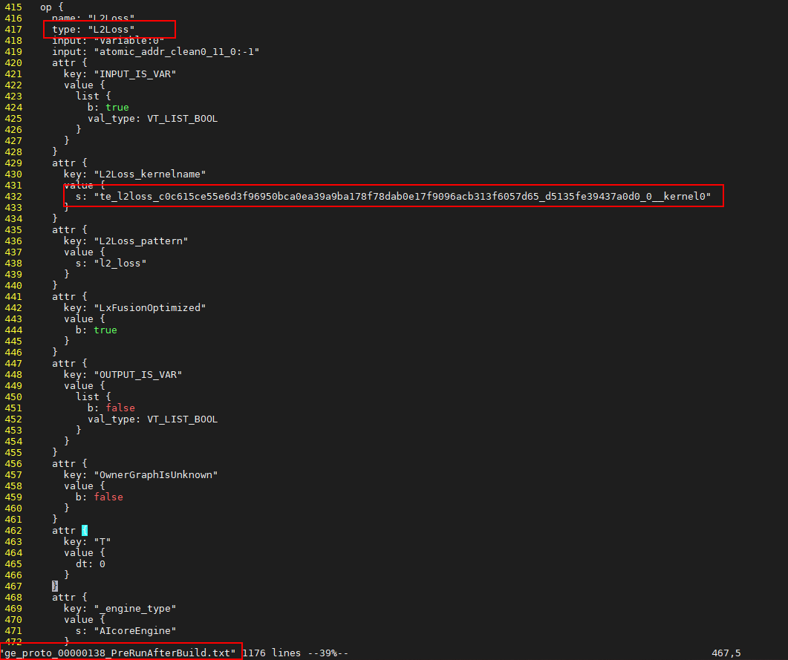

# 构造单算子复现用例<a name="ZH-CN_TOPIC_0000001230066675"></a>

本工具旨在通过构造单算子复现用例，缩短问题定位时间。

## 获取报错单算子<a name="section1518716112046"></a>

当AI Core Error发生时，查看打屏日志，可以看到报错的算子名，针对该算子进行复现。例如：

EZ9999: Inner Error!

The device\(0\), core list\[0-0\], error code is:\[FUNC:PrintCoreInfoErrMsg\]\[FILE:device\_error\_proc.cc\]\[LINE:417\]

coreId\( 0\):        0x800000    \[FUNC:PrintCoreInfoErrMsg\]\[FILE:device\_error\_proc.cc\]\[LINE:428\]

Aicore kernel execute failed, device\_id=0, stream\_id=5, report\_stream\_id=3, task\_id=3, fault kernel\_name=0\_11\_L2Loss, func\_name=**te\_l2loss\_c0c615ce55e6d3f96950bca0ea39a9ba178f78dab0e17f9096acb313f6057d65\_d5135fe39437a0d0\_0\_\_kernel0**, program id=3, hash=2896346369331939785\[FUNC:GetError\]\[FILE:stream.cc\]\[LINE:712\]

Stream synchronize failed, stream = 0xfffe24161eb0\[FUNC:StreamSynchronize\]\[FILE:logger.cc\]\[LINE:274\]

rtStreamSynchronize execute failed, reason=\[the model stream execute failed\]\[FUNC:FuncErrorReason\]\[FILE:error\_message\_manage.cc\]\[LINE:39\]

## 准备溢出dump数据<a name="section9992124216229"></a>

1.  准备溢出dump数据前，用户需在重新执行训练前导入如下环境变量。

    ```
    export DUMP_GE_GRAPH=1  # 控制dump图的内容多少,取值为1，全量dump
    export DUMP_GRAPH_LEVEL=1  # 控制dump图的个数,取值为1，dump所有图
    export ASCEND_GLOBAL_LOG_LEVEL=1  # 设置全局日志级别，取值为1，代表INFO
    ```
    
2.  然后，参考如下步骤配置op\_debug\_level和enable\_exception\_dump参数。

    -   Estimator模式下，开启op\_debug\_level和enable\_exception\_dump：

        ```
        from npu_bridge.estimator.npu.npu_config import NPURunConfig
        from npu_bridge.estimator.npu.npu_config import DumpConfig
        
        session_config=tf.ConfigProto()
        
        config = NPURunConfig(
          op_debug_level = 2,            # 开启算子debug功能。
          session_config=session_config,
          enable_exception_dump=1       # Dump AI Core Error算子的输入和输出信息，dump信息生成在当前脚本执行目录。不支持dump动态shape算子。
          )
        ```

    -   sess.run模式下，开启op\_debug\_level和enable\_exception\_dump：

        ```
        import tensorflow as tf
        from npu_bridge.estimator import npu_ops
        from tensorflow.core.protobuf.rewriter_config_pb2 import RewriterConfig
        
        config = tf.ConfigProto()
        
        custom_op =  config.graph_options.rewrite_options.custom_optimizers.add()
        custom_op.name =  "NpuOptimizer" 
        custom_op.parameter_map["use_off_line"].b = True
        custom_op.parameter_map["enable_exception_dump"].i = 1   # Dump AI Core Error算子的输入和输出信息，dump信息生成在当前脚本执行目录。不支持dump动态shape算子。
        custom_op.parameter_map["op_debug_level"].i = 2          # 开启算子debug功能。
        config.graph_options.rewrite_options.remapping = RewriterConfig.OFF  # 关闭remap开关
        
        with tf.Session(config=config) as sess:
          print(sess.run(cost))
        ```

    **表 1**  op\_debug\_level参数取值说明

    <a name="table1647105316514"></a>
    <table><thead align="left"><tr id="row1047125317514"><th class="cellrowborder" valign="top" width="6.81%" id="mcps1.2.3.1.1"><p id="p147115315515"><a name="p147115315515"></a><a name="p147115315515"></a>取值</p>
    </th>
    <th class="cellrowborder" valign="top" width="93.19%" id="mcps1.2.3.1.2"><p id="p14471553175110"><a name="p14471553175110"></a><a name="p14471553175110"></a>说明</p>
    </th>
    </tr>
    </thead>
    <tbody><tr id="row94711153195119"><td class="cellrowborder" valign="top" width="6.81%" headers="mcps1.2.3.1.1 "><p id="p11471853115118"><a name="p11471853115118"></a><a name="p11471853115118"></a>0</p>
    </td>
    <td class="cellrowborder" valign="top" width="93.19%" headers="mcps1.2.3.1.2 "><p id="p247114533516"><a name="p247114533516"></a><a name="p247114533516"></a>不开启算子debug功能，默认为0。</p>
    </td>
    </tr>
    <tr id="row13806231105218"><td class="cellrowborder" valign="top" width="6.81%" headers="mcps1.2.3.1.1 "><p id="p6806193125216"><a name="p6806193125216"></a><a name="p6806193125216"></a>1</p>
    </td>
    <td class="cellrowborder" valign="top" width="93.19%" headers="mcps1.2.3.1.2 "><p id="p180683185213"><a name="p180683185213"></a><a name="p180683185213"></a>开启算子debug功能，在训练脚本执行目录下的kernel_meta文件夹中生成TBE指令映射文件（算子cce文件*.cce、python-cce映射文件*_loc.json、.o和.json文件），用于后续工具进行AI Core Error问题定位。</p>
    </td>
    </tr>
    <tr id="row62593425214"><td class="cellrowborder" valign="top" width="6.81%" headers="mcps1.2.3.1.1 "><p id="p10251334115211"><a name="p10251334115211"></a><a name="p10251334115211"></a>2</p>
    </td>
    <td class="cellrowborder" valign="top" width="93.19%" headers="mcps1.2.3.1.2 "><p id="p75065984317"><a name="p75065984317"></a><a name="p75065984317"></a>开启算子debug功能，在训练脚本执行目录下的kernel_meta文件夹中生成TBE指令映射文件（算子cce文件*.cce、python-cce映射文件*_loc.json、.o和.json文件），并关闭编译优化开关（开启ccec编译器选项-O0-g），用于后续工具进行AI Core Error问题定位，可定位到出错算子的代码行号。</p>
    </td>
    </tr>
    </tbody>
    </table>

3.  重新执行训练后，会在训练执行目录下生成指令映射文件和异常算子dump文件。

## 解析溢出dump数据<a name="section14854129142313"></a>

1.  在[准备溢出dump数据](#section9992124216229)环节生成的数据中找到溢出数据文件，例如L2Loss.L2Loss.3.1638329841577837。
2.  进入解析脚本所在路径。

    假设Toolkit软件包安装目录为： /usr/local/Ascend。则命令为：

    **cd /usr/local/Ascend/toolkit/tools/operator\_cmp/compare**

3.  执行解析命令。例如：

    **python3.7.5 msaccucmp.pyc convert -d /home/user/tf/L2Loss.L2Loss.3.1638329841577837 -out /home/user/tf/result**

    > **说明：** 
    >/home/user/tf/L2Loss.L2Loss.3.1638329841577837、/home/user/tf/result为举例路径，请根据实际情况替换。
    >本示例解析得到npy文件：L2Loss.L2Loss.3.1638329841577837.input.0.npy。


## 构造单算子复现用例<a name="section9651629192315"></a>

基于已获取的单算子复现用例工具，修改main.py文件相关内容信息。

通过kernel\_name在GE图中可以获取该Node的算子type以及输入输出等信息。

**图 1**  获取算子信息<a name="fig99710933018"></a>  


在kernel\_meta中获取.o与.json文件路径，在[解析溢出dump数据](#section14854129142313)中获取输入数据。

构造用例如下：

```
from op_test_frame.ut import OpUT
       
def run_sample_case():
      ut_case = OpUT("L2Loss", None, None)
      
      case1 = { "params": [{"shape": (62,62), "dtype": "float32", "format":"ND", "ori_shape": (62,62),"ori_format": "ND","value":"/home/user/tf/result/L2Loss.L2Loss.3.1638329841577837.input.0.npy"},
                   {"shape": (), "dtype": "float32", "format": "ND","ori_shape": (),"ori_format": "ND"}],
                  "case_name":"te_l2loss_c0c615ce55e6d3f96950bca0ea39a9ba178f78dab0e17f9096acb313f6057d65_f60e652462a30de2_0",
 "bin_path":"/home/user/tf/kernel_meta/te_l2loss_c0c615ce55e6d3f96950bca0ea39a9ba178f78dab0e17f9096acb313f6057d65_f60e652416a30de2_0.o"
}
       ut_case.add_direct_case(case1)
       ut_case.run("all")
if __name__ == '__main__':
      run_sample_case()
```

-   "params"：算子输入信息。
-   "value"：算子输入数据。
-   "case\_name"：用例名称。
-   "bin\_path"：算子.o的名称。需要注意的是，工具使用bin\_path值替换.o为.json的方式获取json文件。

保存用例文件main.py，运行用例：

**python3.7 main.py**

运行结果分析：

1.  不能复现整网问题，则说明单算子无问题。使用[地址异常检测工具](https://github.com/Ascend/tools/tree/master/addr_checker)工具进行深入定位。
2.  复现整网问题，则说明单算子存在问题。此时分两种情况：
    1.  输入数据存在问题。通过msaccucmp.py精度比对工具解析dump数据，查看是否存在异常值。相关操作请参见

        《[精度比对工具使用指南]([简介_昇腾CANN社区版(5.0.4.alpha003)(训练)_开发辅助工具_精度比对工具使用指南_华为云 (huaweicloud.com)](https://support.huaweicloud.com/developmenttg-cann504alpha3training/atlasaccuracy_16_0003.html))》。

    2.  输入数据不存在问题。使用AI Core Error解析工具，查看报错CCE行数。通过行数，查看算子逻辑，进行问题定位分析。相关操作请参见《[AI Core Error分析工具使用指南]([功能介绍_昇腾CANN社区版(5.0.4.alpha003)(训练)_开发辅助工具_AI Core Error分析工具使用指南_华为云 (huaweicloud.com)](https://support.huaweicloud.com/developmenttg-cann504alpha3training/atlasaicerrtrain_16_0003.html))》。

